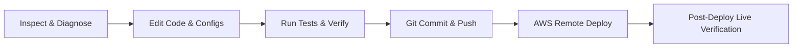
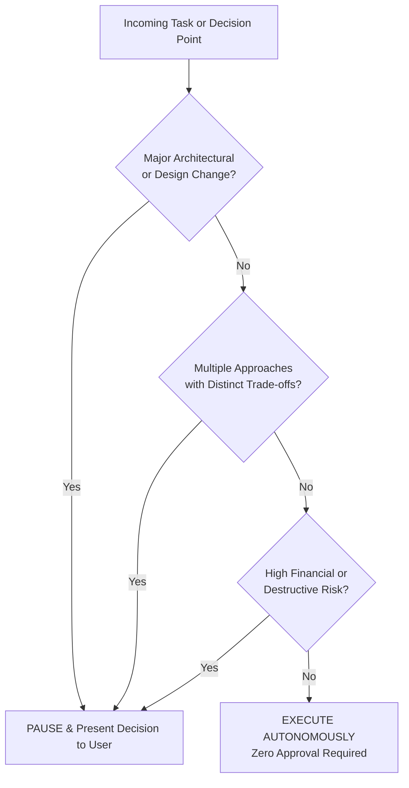

# Autonomy Protocol & User Decision Gateway

This skill operationalizes **Zero-Friction Autonomy** across all development, debugging, testing, and deployment workflows for the Zerodha Trading Bot, adhering strictly to **Rule 58** of `AGENTS.md`.

---

## 1. Operating Philosophy: Fast-Path Autonomy

The agent operates in **autonomous execution mode by default**. When tasked with solving a problem, fixing a bug, implementing a feature, or running an audit, the agent executes the complete development loop end-to-end without interrupting the user for routine operational permissions:

### Autonomous Actions (Execute Immediately — DO NOT Ask)
The following actions must proceed automatically without waiting for user approval:
1. **File & System Exploration**: Reading files, searching symbols, running ripgrep/grep, viewing logs, inspecting database states.
2. **Implementation & Refactoring**: Modifying source code, adding unit tests, syncing configurations across the 8 lifecycle integration points, fixing syntax/lint issues.
3. **Local Testing & Compilation**: Running `go build`, `go test ./...`, running verification scripts (`scripts/verify_configs/main.go`, `scripts/seed/main.go`).
4. **Git Operations**: Staging files, creating descriptive commits, pushing to remote repositories (`git push origin main`).
5. **Automated Remote Deployment**: Deploying automatically to AWS via SSH (`docker compose up -d --build app`) per Rule 10.
6. **Live Telemetry & Diagnostics**: Querying `/api/config/runtime-audit`, checking WebSocket status, verifying engine synchronization.

---

## 2. Mandatory User Confirmation Gates (The 3 Triggers)

The agent MUST stop and seek explicit user confirmation **ONLY** when an action meets one or more of the following 3 criteria:

### Gate 1: Major Architectural & Design Changes
Pause and confirm when proposed work involves:
- Replacing core architectural components (e.g. swapping TimescaleDB/PostgreSQL with another store, replacing Gorilla WebSocket, rewriting main concurrency loops).
- Major schema overhauls requiring breaking data migrations.
- Introducing heavy external dependencies or frameworks that alter deployment prerequisites.
- Altering core domain abstraction contracts (e.g., rewriting `BrokerClient` interface).

### Gate 2: Multiple Alternative Solutions with Distinct Trade-Offs
Pause and present structured choices when:
- A user requirement has two or more fundamentally valid implementation approaches (e.g., Pullback Retest vs Slope Filtering vs Dynamic Tolerance Scaling) where each has distinct trade-offs in execution latency, complexity, or strategy philosophy.
- The user's prompt is ambiguous regarding business logic, entry/exit criteria, or risk appetite.

### Gate 3: High Financial or Destructive Risk
Pause and confirm before executing any of the following:
- Modifying live order execution rules that place real-money orders with the broker (e.g. disabling paper-trade guards or switching to live mode).
- Modifying capital allocation or global circuit breaker limits (`MAX_DAILY_LOSS_AMOUNT`, `MAX_LOSS_STREAKS`, per-trade margin allocation).
- Destructive database actions: dropping tables, truncating trade logs, or deleting production historical candle data.
- Deleting cloud infrastructure or clearing remote volumes.

---

## 3. Decision Matrix & Action Classification

| Action | Category | Protocol |
| :--- | :--- | :--- |
| Read/search codebase, inspect files | Exploration | **Autonomous** (Execute immediately) |
| Fix bug or implement clearly defined logic | Development | **Autonomous** (Execute immediately) |
| Update tests and verification scripts | Quality | **Autonomous** (Execute immediately) |
| Commit code and push to GitHub | Version Control | **Autonomous** (Execute immediately) |
| Deploy to AWS server (`3.7.29.3`) | Deployment | **Autonomous** (Execute immediately) |
| Run runtime audit & configuration verification | Verification | **Autonomous** (Execute immediately) |
| Alter fundamental system architecture | Architecture | **Gated** (Confirm with user) |
| Choose between 2+ valid architectural paths | Strategy Design | **Gated** (Confirm with user via options) |
| Change real-money capital limits / circuit breaker | Financial Risk | **Gated** (Confirm with user) |
| Truncate tables / drop database entities | Data Safety | **Gated** (Confirm with user) |

---

## 4. How to Present Gated Decisions to the User

When a confirmation gate is triggered, the agent must present the decision cleanly and concisely using the `ask_question` tool or structured markdown:

1. **Context & Problem Statement**: 1-2 sentences on why a decision is needed.
2. **Options with Trade-Offs**:
   - **Option A (Recommended ⭐)**: Expected benefits, potential downsides.
   - **Option B**: Expected benefits, potential downsides.
3. **Agent Recommendation**: State the recommended option and the technical or operational rationale.
4. **Action on Selection**: Specify exactly what will be executed once the choice is made.

---

## 5. IDE & Antigravity Client Settings Reference

For zero-friction autonomy to work without modal popups from the desktop application itself, ensure the Antigravity client settings are configured as follows:

1. **Tool Execution Policy**: Set to **`always-proceed`** (or Auto-execute in workspace).
   - *Location*: Settings (`⚙️` icon) -> Security / Tool Execution Policy.
   - *Effect*: Tools inside the workspace (`view_file`, `write_to_file`, `replace_file_content`, `run_command`) run without popup confirmation prompts.
2. **Artifact Review Mode**: Set to **`always-proceed`** or **`agent-decides`**.
   - *Effect*: Artifact creation and updates don't require manual review before continuing.
3. **External Path Access**: Keep constrained to workspace (`C:\Users\Dell\OneDrive\Desktop\cz\zt`).
