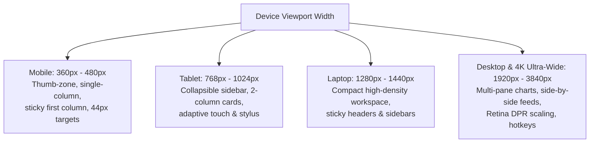

# Fintech Cross-Platform UX/UI & Responsive Engineering Mastery

This skill defines the rigorous design, ergonomics, performance, accessibility, and engineering standards for all frontend work on the **UpTrade / Zerodha Trading Bot** dashboard (`index.html`). It guarantees seamless excellence across **Mobile phones, Tablets, Laptops, Desktops, and 4K Ultra-Wide multi-monitor trading setups**.

---

## 1. Core Mission: Zero-Regression & Customer Trust

In algorithmic trading and financial apps, **UX failures cause customer churn and financial stress**. A broken layout, an obscured confirmation button, an unreadable P&L column, or a sluggish chart directly destroys user trust.

### The Golden Rule of Frontend Engineering
> **"Never break an existing user flow, never introduce layout shifts, never degrade chart FPS, and never release an unverified mobile or desktop view."**

Every frontend change must:
1. **Preserve All Existing Features**: Maintain active WebSocket streams, polling intervals, modal states, keyboard shortcuts, and chart marker synchronizations.
2. **Be Pixel-Perfect & Intuitive**: Adhere to institutional trading terminal aesthetics (TradingView, Zerodha Kite, Linear, Bloomberg).
3. **Be Cross-Device Optimized**: Adapt fluidly from a 360px mobile viewport up to 3840px 4K ultra-wide displays without awkward whitespace or clipped controls.

---

## 2. Cross-Device Responsive Architecture



---

## 3. Desktop, Laptop & Ultra-Wide Monitor Engineering ($\ge 1280\text{px}$)

Professional traders use laptops, high-resolution monitors (2K/4K), and ultra-wide displays (21:9, 32:9). The UI must leverage this screen real estate effectively.

### 3.1 High-Density Workspace Utilization
- **No Wasted Whitespace**: Expand layout horizontally to present watchlist, chart canvas, live telemetry, and open positions concurrently without requiring tab-switching.
- **Tiled Multi-Pane Charting**: Support side-by-side dual charts (e.g. NIFTY 50 + BANKNIFTY or 1m + 5m timeframes) on screens $\ge 1920\text{px}$.
- **Max-Width Readability Bounds**: For text-heavy modals, audit logs, and settings forms, constrain reading width (`max-width: 900px; margin: 0 auto;`) to prevent uncomfortable eye strain across 34-inch ultra-wides.

### 3.2 Retina & High-DPI Crispness (`devicePixelRatio`)
- Canvas rendering on high-DPI screens (MacBook Retina, 4K monitors) can become blurry if not scaled to `window.devicePixelRatio`:
  - LightweightCharts natively handles DPR when initialized with responsive container dimensions.
  - Custom canvas overlays and icons must use SVG or crisp vector fonts (`Plus Jakarta Sans`, `Outfit`, `JetBrains Mono`).

### 3.3 Desktop Power-User Keyboard Ergonomics
- Implement keyboard shortcuts expected in professional trading terminals:
  - `Esc`: Dismiss active modal or overlay.
  - `Space` / `Down Arrow`: Highlight next stock in watchlist.
  - `/` or `Ctrl + K`: Focus global stock search input.
  - `F`: Toggle chart full-canvas mode.
  - `Ctrl + S`: Instant save in Settings modal without requiring mouse click on the bottom button.

### 3.4 Sticky Vertical Table Headers (`top: 0`)
- When scrolling through 100+ stock rows, table header columns must never disappear:
  ```css
  .table-wrapper thead th {
      position: sticky;
      top: 0;
      z-index: 3;
      background: var(--table-hdr-solid-bg);
      backdrop-filter: blur(8px);
      box-shadow: 0 2px 4px rgba(0, 0, 0, 0.15);
  }
  ```

### 3.5 Hover Depth & Contextual Micro-Interactions
- On pointer devices (`@media (hover: hover)`):
  - Table rows highlight with smooth CSS transitions (`background: var(--table-row-hover)`).
  - Rich hover tooltips on indicators reveal math context (Delta, Theta, EMA distance, Wick %, SL distance).
  - Copy-to-clipboard badges show instant feedback tooltip (*"Copied!"*).

---

## 4. Mobile Ergonomics & Touch-Zone Architecture ($\le 768\text{px}$)

### 4.1 The 44px Minimum Touch Target Rule (Apple HIG & Google Material)
- Every interactive element (buttons, tabs, inputs, dropdowns, table row click targets, chart tools) MUST have a minimum clickable/tappable hit area of **$44 \times 44\text{px}$** (or $48 \times 48\text{px}$ where space permits).
- If the visual icon or text is smaller (e.g. 16px icon), use CSS padding or pseudo-elements (`::after`) to expand the tap target:
  ```css
  .mobile-touch-target {
      position: relative;
      min-width: 44px;
      min-height: 44px;
      display: inline-flex;
      align-items: center;
      justify-content: center;
  }
  ```

### 4.2 The Mobile "Thumb Zone"
- Place the most critical, high-frequency actions within the natural sweep of the user's thumb (bottom third of mobile screens):
  - Bottom navigation bar or floating action buttons for quick watchlist switching, square-off triggers, and telemetry view.
  - Secondary or destructive actions (deep settings, broker disconnection) placed in top bars or behind double-confirmation modals.

### 4.3 iOS Auto-Zoom Prevention
- iOS Safari automatically zooms in on any form input whose `font-size` is less than `16px`, breaking layout framing.
- **Rule**: On screens $\le 768\text{px}$, all inputs, selects, and textareas MUST have `font-size: 16px !important;` or `font-size: max(16px, 1rem);`.

### 4.4 Safe Area Insets (Notch & Home Bar Protection)
- Account for modern smartphone notches and bottom home navigation bars:
  ```css
  body {
      padding-top: env(safe-area-inset-top, 0px);
      padding-bottom: env(safe-area-inset-bottom, 0px);
      padding-left: env(safe-area-inset-left, 0px);
      padding-right: env(safe-area-inset-right, 0px);
  }
  ```

---

## 5. High-Density Financial Tables (Mobile & Desktop)

Trading dashboards display dozens of critical data points: Symbol, LTP, Change%, High, Low, Volume, RSI, SuperTrend, Position, P&L, Status.

### 5.1 The Sticky Identifier Column Pattern
- Never force a user to scroll horizontally and lose track of which stock or trade they are viewing.
- The primary column (`Symbol` / `Instrument`) MUST be sticky on horizontal table scrolls:
  ```css
  .table-wrapper {
      overflow-x: auto;
      -webkit-overflow-scrolling: touch;
      position: relative;
  }
  .table-wrapper th:first-child,
  .table-wrapper td:first-child {
      position: sticky;
      left: 0;
      z-index: 2;
      background: var(--table-hdr-solid-bg);
      box-shadow: 2px 0 5px rgba(0, 0, 0, 0.2);
  }
  ```

### 5.2 Tabular Numerals & Vertical Alignment
- Always apply `font-variant-numeric: tabular-nums;` or monospaced font (`font-family: 'JetBrains Mono', 'Roboto Mono', monospace;`) to all numbers, prices, timestamps, and percentages.
- **Alignment Standards**:
  - Stock symbols, badges, strategies: **Left-aligned**.
  - Quantities, prices, P&L, percentages: **Right-aligned** (ensuring decimal points align vertically for rapid comparison).
  - Status chips, actions, toggles: **Center-aligned**.

### 5.3 Responsive Card/Tile Transformation on Ultra-Small Screens (< 480px)
- When a 12-column table becomes too dense for mobile, provide a toggle or automatically collapse rows into high-context card views displaying:
  - Header: Stock Symbol + Strategy Badge + Live LTP
  - Body: P&L (prominent color pill) + Entry/Exit Times + Trailing SL
  - Action: Quick detail/audit modal button

---

## 6. LightweightCharts & Canvas Responsiveness

The TradingView Lightweight Charts library renders on an HTML5 canvas that requires explicit width and height calculations.

### 6.1 Automated ResizeObserver Synchronization
- Never rely on static pixel widths for charts. Always bind a `ResizeObserver` to the chart container:
  ```javascript
  const resizeObserver = new ResizeObserver(entries => {
      if (!entries || entries.length === 0 || !chart) return;
      const { width, height } = entries[0].contentRect;
      if (width > 0 && height > 0) {
          chart.applyOptions({ width, height });
          chart.timeScale().fitContent();
      }
  });
  resizeObserver.observe(chartContainerElement);
  ```

### 6.2 Mobile Touch Gesture Configuration
- Prevent chart interaction from hijacking page scrolling when users try to scroll past the chart:
  ```javascript
  chart.applyOptions({
      handleScroll: {
          mouseWheel: true,
          pressedMouseMove: true,
          horzTouchDrag: true, // Allow panning candles horizontally with finger
          vertTouchDrag: false // Allow native vertical page scrolling without chart capture
      },
      handleScale: {
          axisPressedMouseMove: true,
          mouseWheel: true,
          pinch: true // Enable native two-finger pinch-to-zoom on mobile
      }
  });
  ```

### 6.3 Crosshair & Floating Tooltip Ergonomics
- On mobile: OHLC + SuperTrend values are displayed in a fixed compact top status bar above the chart to keep candles unobstructed.
- On desktop: Rich magnetic crosshair tracking displays exact values in real-time on price/time scales.

---

## 7. Dual-Theme Mastery & Color Psychology

### 7.1 Universal Theme Synchronization
Every UI element created or modified MUST support both dark and light modes:
- **Dark Theme (`:root`)**: Premium deep navy/slate (`--bg-base: #06090F`, `--bg-card: #0E1624`, `--text-primary: #F9FAFB`).
- **Light Theme (`html.light-theme`, `body.light-theme`)**: Crisp professional off-white (`--bg-base: #F8F9FA`, `--bg-card: #FFFFFF`, `--text-primary: #111827`).
- Never hardcode `#000`, `#FFF`, `rgba(255,255,255,0.1)`, or `#333` directly in CSS rules without corresponding `light-theme` definitions. Always use CSS custom properties (`var(--...)`).

### 7.2 Financial Semantics & Contrast
- **Profits / Buy / Bullish**: `#089981` (Teal-green, calm, trustworthy, high contrast against both black and white).
- **Losses / Sell / Bearish**: `#f23645` (Vibrant coral-red, high visibility).
- **Neutral / Informational**: `#6366F1` (Indigo/Purple accent).
- Minimum contrast ratio of **4.5:1** (WCAG AA compliant) for all numerical metrics and status indicators.

---

## 8. Performance, Micro-Interactions & Trust Builders

### 8.1 Sub-Millisecond DOM Updates
- Market data ticks arrive up to 10 times per second.
- Never re-render the entire table `innerHTML` on every tick.
- Update specific cell elements via targeted element IDs (`document.getElementById('ltp-' + symbol).textContent = ...`) or use DocumentFragments / virtualized row buffers to prevent browser jank.

### 8.2 Destructive Action Confirmation Rails
- Square-off buttons, emergency pause switches, and position exit controls must have safety guards:
  - Micro-haptic/micro-animation feedback on touch.
  - Two-step confirmation modal or slide-to-confirm pattern on mobile to eliminate fat-finger trading disasters.

### 8.3 Graceful Degradation & State Awareness
- If the WebSocket connection drops, immediately display a non-obtrusive, persistent yellow warning banner:
  - *"WebSocket Reconnecting... Displaying last cached quotes (11:42:05 IST)"*
- Prevent displaying stale quotes as live prices.

---

## 9. Mandatory Cross-Device Verification Protocol

Before declaring any frontend change complete, the agent must perform the following audit:

1. **Multi-Viewport Audit**:
   - Small Mobile: 360px – 390px (iPhone 13/14/15, Galaxy S22)
   - Standard Mobile: 412px – 480px (Pixel, Large iPhones)
   - Tablet: 768px – 1024px (iPad, Android tablets)
   - Laptop: 1366px – 1440px (MacBook Air, ThinkPad)
   - Desktop & 4K Ultra-Wide: 1920px – 3840px (1080p, 1440p, 4K, 21:9 monitors)
2. **Touch & Click Ergonomics**:
   - Touch targets $\ge 44\times 44\text{px}$ on touch devices.
   - Hover states, cursor pointers, and keyboard hotkeys active on desktop.
3. **Table & Chart Layout**: Sticky headers (`top: 0`) and sticky first columns (`left: 0`) stay anchored; charts automatically resize without overflow on window snapping or screen rotation.
4. **Theme Verification**: Switch between Dark and Light mode—verify text readability, table row borders, card backgrounds, and input contrast.
5. **No Visual Overlap / Text Truncation**: No badges wrapping awkwardly, zero text spilling out of containers, proper ellipsis (`text-overflow: ellipsis; overflow: hidden; white-space: nowrap;`).
6. **Zero Browser Console Errors**: Inspect browser logs to confirm zero JavaScript exceptions (`Uncaught TypeError`, undefined properties, or unhandled promise rejections).
