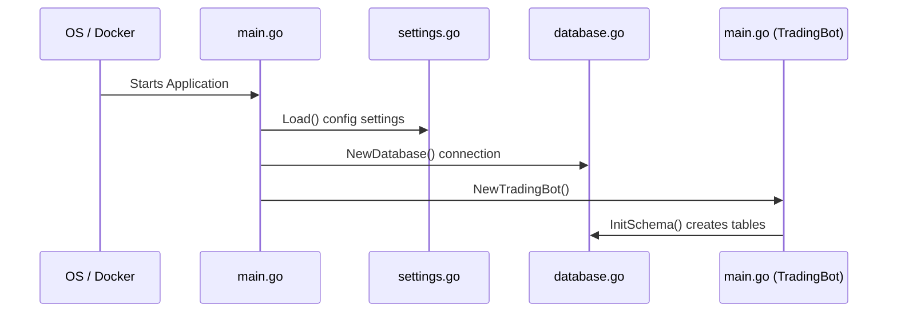
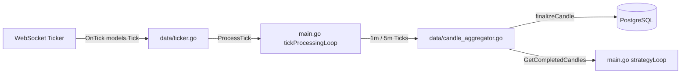
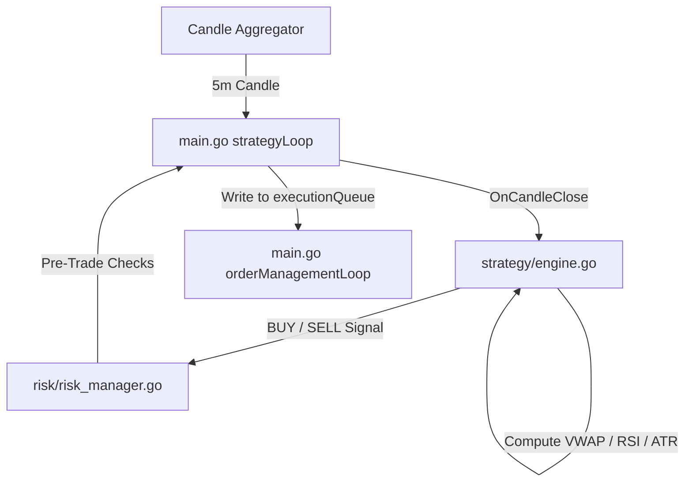
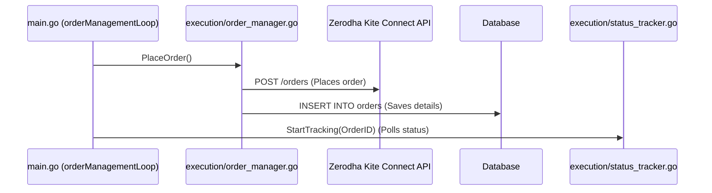

# Zerodha Trading Bot End-to-End Architecture & Execution Flow

This document details the complete end-to-end lifecycle, directory structure, function mappings, and execution flows of the Zerodha algorithmic trading bot.

---

## 1. Startup & Initialization

When the application binary starts, it initializes the database connection, performs schema migrations, and registers all core subsystems.

### Flow & Code Mapping:
1. **Application Launch**:
   * **File**: [main.go](file:///C:/Users/Dell/OneDrive/Desktop/cz/zt/main.go)
   * **Function**: `main()` (Line 38)
2. **Configuration Loading**:
   * **File**: [config/settings.go](file:///C:/Users/Dell/OneDrive/Desktop/cz/zt/config/settings.go)
   * **Function**: `Load()` (Line 59)
   * *Loads API credentials and trading parameters from `.env`.*
3. **Database Connection**:
   * **File**: [data/database.go](file:///C:/Users/Dell/OneDrive/Desktop/cz/zt/data/database.go)
   * **Function**: `NewDatabase(...)` (Line 22)
   * *Connects to the TimescaleDB/PostgreSQL container.*
4. **Trading Bot Subsystems Assembly**:
   * **File**: [main.go](file:///C:/Users/Dell/OneDrive/Desktop/cz/zt/main.go)
   * **Function**: `NewTradingBot(...)` (Line 49)
   * **Line 61**: Runs `db.InitSchema()` to create tables (`candles_1m`, `candles_5m`, `orders`, `positions`, `trades`, `metadata_cache`).
   * **Line 69**: Creates the WebSocket ticker client via `data.NewRobustKiteTicker(...)` in [ticker.go](file:///C:/Users/Dell/OneDrive/Desktop/cz/zt/data/ticker.go#L33).
   * **Line 70–71**: Instantiates the 5-minute and 1-minute aggregators via `data.NewCandleAggregator(...)` in [candle_aggregator.go](file:///C:/Users/Dell/OneDrive/Desktop/cz/zt/data/candle_aggregator.go#L59).
   * **Line 74–75**: Instantiates the Kite Connect REST API client.
   * **Line 77**: Creates the `SecurityMaster` in [security_master.go](file:///C:/Users/Dell/OneDrive/Desktop/cz/zt/data/security_master.go#L40) to match constituent symbols to real tokens.
   * **Line 87–90**: Instantiates the `OrderManager`, `StatusTracker`, and `RiskManager`.

---

## 2. Event Loop Startup

* **File**: [main.go](file:///C:/Users/Dell/OneDrive/Desktop/cz/zt/main.go)
* **Function**: `Run()` (Line 122)
  * **Line 127**: Executes `startupChecks()` (Line 368) to verify database connectivity and check if the market is open.
  * **Line 132**: Calls `tb.securityMaster.GetNifty50Constituents(...)` to load the list of active stock tokens (e.g. Reliance, TCS) from cache or the Zerodha instruments list.
  * **Line 143**: Calls `tb.ticker.Connect(...)` in [ticker.go](file:///C:/Users/Dell/OneDrive/Desktop/cz/zt/data/ticker.go#L44) to open the WebSocket and subscribe to these instrument tokens.
  * **Line 150–154**: Spawns the concurrent background loops:
    * `tickProcessingLoop()` (Line 162)
    * `strategyLoop()` (Line 205)
    * `orderManagementLoop()` (Line 255)
    * `monitoringLoop()` (Line 292)
    * `startWebDashboard()` (Line 225) - *Serves the interactive HTML UI and database APIs on port 8080.*
  * **Line 156**: Spawns a background goroutine to drain the 1m candle aggregator channel so the channel buffer doesn't overflow.

---

## 3. Ingestion & Aggregation Loop (Tick processing)

Market tick data streams from the WebSocket ticker and is aggregated into 1-minute and 5-minute timeframes.

### Flow & Code Mapping:
1. **WebSocket Ingestion**:
   * **File**: [data/ticker.go](file:///C:/Users/Dell/OneDrive/Desktop/cz/zt/data/ticker.go)
   * **Function**: `OnTick(...)` (Line 91)
   * *Maps incoming ticks from Zerodha's WebSocket server to the bot's internal struct and runs `processTick(t)`.*
2. **Tick Routing**:
   * **File**: [main.go](file:///C:/Users/Dell/OneDrive/Desktop/cz/zt/main.go)
   * **Function**: `tickProcessingLoop()` (Line 162)
   * *Periodically gets the latest tick for each stock and feeds them to both the 1-minute (`candleAgg1m`) and 5-minute (`candleAgg`) aggregators.*
3. **Candle Aggregation**:
   * **File**: [data/candle_aggregator.go](file:///C:/Users/Dell/OneDrive/Desktop/cz/zt/data/candle_aggregator.go)
   * **Function**: `ProcessTick(...)` (Line 79)
   * *Updates candle High, Low, Close, Volume, and VWAP based on time intervals.*
4. **Candle Finalization**:
   * **File**: [data/candle_aggregator.go](file:///C:/Users/Dell/OneDrive/Desktop/cz/zt/data/candle_aggregator.go)
   * **Function**: `finalizeCandle(...)` (Line 149)
   * **Line 153–158**: Computes the candle color (sets `GREEN` if close > open, `RED` if close < open, or `DOJI` if flat).
   * **Line 173**: Calls `persistCandle(...)` (Line 191) to insert the finalized candle into PostgreSQL.
   * **Line 185**: Pushes the completed candle down the channel for the strategy engine.

---

## 4. Strategy & Trading Signals Loop

Completed candles trigger the indicator calculators to evaluate mean reversion logic.

### Flow & Code Mapping:
1. **Strategy Loop**:
   * **File**: [main.go](file:///C:/Users/Dell/OneDrive/Desktop/cz/zt/main.go)
   * **Function**: `strategyLoop()` (Line 205)
   * *Listens for finalized 5-minute candles from the channel.*
2. **Signal Computation**:
   * **File**: [strategy/engine.go](file:///C:/Users/Dell/OneDrive/Desktop/cz/zt/strategy/engine.go)
   * **Function**: `OnCandleClose(...)` (Line 54)
   * **Line 58**: Loads the last `N` candles from the database to compute indicators.
   * **Line 78**: Calculates the Volume-Weighted Average Price (VWAP).
   * **Line 83**: Calculates the Relative Strength Index (RSI).
   * **Line 88–120**: Determines signals:
     * **BUY**: Price is below `VWAP - 1.5 * StdDev` and `RSI < 30` (Oversold).
     * **SELL**: Price is above `VWAP + 1.5 * StdDev` and `RSI > 70` (Overbought).
3. **Pre-Trade Risk Management**:
   * **File**: [main.go](file:///C:/Users/Dell/OneDrive/Desktop/cz/zt/main.go)
   * **Function**: `strategyLoop()` (Line 205)
   * **Line 232**: Calls `tb.riskMgr.EvaluatePreTrade(...)` in [risk_manager.go](file:///C:/Users/Dell/OneDrive/Desktop/cz/zt/risk/risk_manager.go#L64) to verify daily loss limits, position sizing, and trade streaks.
   * **Line 247**: If checks pass, pushes the order into `tb.executionQueue`.

---

## 5. Execution & Order Management Loop

Places the order via Zerodha's API and tracks its fill status.

### Flow & Code Mapping:
1. **Order Processing**:
   * **File**: [main.go](file:///C:/Users/Dell/OneDrive/Desktop/cz/zt/main.go)
   * **Function**: `orderManagementLoop()` (Line 255)
   * *Receives signals from the `tb.executionQueue` channel.*
2. **Order Placement**:
   * **File**: [execution/order_manager.go](file:///C:/Users/Dell/OneDrive/Desktop/cz/zt/execution/order_manager.go)
   * **Function**: `PlaceOrder(...)` (Line 50)
   * **Line 60–65**: Invokes Zerodha's order placement API.
   * **Line 75**: Writes the new order details to the `orders` database table.
3. **Order Status Tracking**:
   * **File**: [main.go](file:///C:/Users/Dell/OneDrive/Desktop/cz/zt/main.go)
   * **Function**: `orderManagementLoop()` (Line 255)
   * **Line 271**: Starts tracking the order status by calling `tb.statusTracker.StartTracking(...)` in [status_tracker.go](file:///C:/Users/Dell/OneDrive/Desktop/cz/zt/execution/status_tracker.go#L52).
   * *StatusTracker polls Zerodha in the background. Once filled, it updates the database, registers the open position inside the RiskManager, and trails the stop-loss boundaries.*
