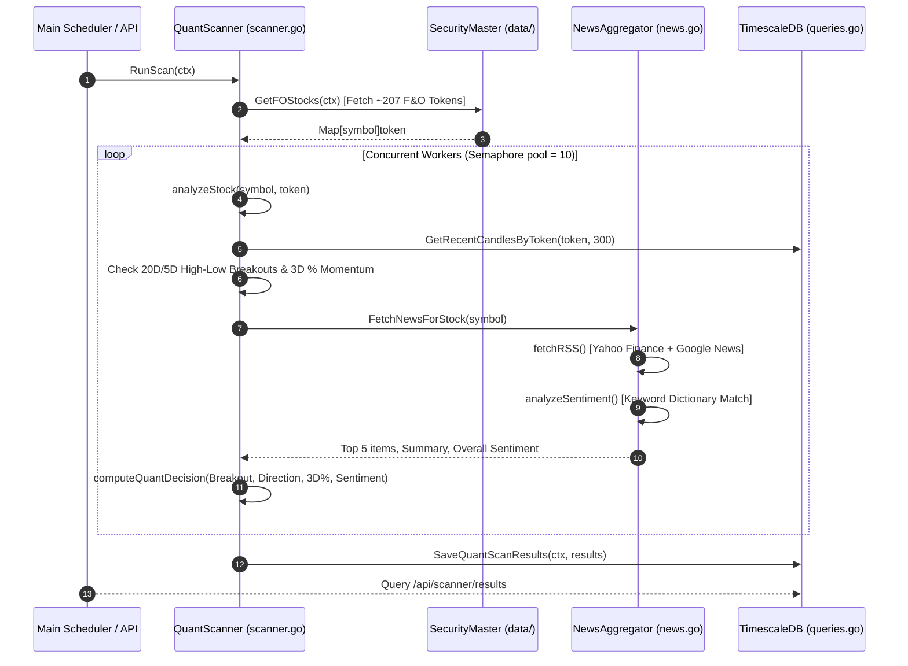

# Zerodha Automated Intraday Trading Bot

Production-grade Go implementation of an algorithmic intraday trading system for Zerodha Kite Connect API.

## Architecture

### Components

- **Data Layer** (`data/`): WebSocket ticker, OHLCV candle aggregation, security master, time-series database
- **Strategy Layer** (`strategy/`): Technical indicators (VWAP, ATR, RSI), signal generation engine
- **Execution Layer** (`execution/`): Order placement, status tracking, resilient API wrapper
- **Risk Management** (`risk/`): Capital preservation, position tracking, circuit breakers
- **Monitoring** (`monitoring/`): Structured logging, Prometheus metrics

### Key Features

✅ **Resilient**: Automatic retry with exponential backoff, circuit breaker for cascading failures  
✅ **Real-time**: WebSocket ticker, 5-minute candle aggregation, sub-second latency  
✅ **Safe**: Dynamic SL with ATR, capital preservation, daily loss limits, margin monitoring  
✅ **Observable**: Prometheus metrics, structured logging (JSON), order tracking  
✅ **Web Dashboard**: Interactive real-time candlestick charts with execution trade markers and dynamic tooltips
✅ **Modular**: Clean separation of concerns, easy to extend strategies  

## Prerequisites

- Go 1.24+
- PostgreSQL 13+ (for TimescaleDB and caching)
- Zerodha Kite Connect API credentials

## Setup

### 1. Environment Configuration

```bash
cp .env.example .env
```

Edit `.env`:

```env
# Zerodha Kite API
KITE_API_KEY=your_api_key
KITE_API_SECRET=your_api_secret
KITE_USER_ID=your_user_id
KITE_ACCESS_TOKEN=your_access_token

# Database
DB_HOST=localhost
DB_PORT=5432
DB_USER=postgres
DB_PASSWORD=your_password
DB_NAME=zerodha_trading
DB_SSL_MODE=disable


# Trading
INITIAL_CAPITAL=500000
MAX_TRADES_PER_DAY=20
MAX_LOSS_STREAKS=3
MAX_HOLDING_TIME_MIN=30
MAX_CAPITAL_PER_TRADE=20000.0
MAX_DAILY_LOSS_AMOUNT=10000.0

# Monitoring
LOG_LEVEL=info
```

### 2. Database Setup

```bash
# Create database and enable TimescaleDB
createdb zerodha_trading
psql zerodha_trading -c "CREATE EXTENSION IF NOT EXISTS timescaledb;"
```

### 3. Dependencies

```bash
go mod download
go mod tidy
```

### 4. Build & Run

```bash
go build -o trading-bot
./trading-bot
```

### 5. Seeding Historical Data

To seed 1 week of historical 1-minute and 5-minute candles for all Nifty 50 instruments into the database, run:

```bash
go run scripts/seed/main.go
```

* **Live Mode**: If a valid `KITE_ACCESS_TOKEN` is configured in `.env`, the script will query Zerodha's `/historical` API to load real historical candles.
* **Mock Mode**: If no access token is set, it automatically falls back to generating a high-fidelity procedural simulation.

## Interactive Web Dashboard

The application features an embedded, high-performance web dashboard to track trades, monitor watchlist tickers, and visualize live intraday charts.

### 🌐 Accessing the Dashboard

Once the application container starts, open your browser and navigate to:
👉 **`http://localhost:8080/zt`**

*(Note: Navigating to the root `http://localhost:8080/` automatically redirects you to `/zt` via a `301 Moved Permanently` header).*

### 📊 Key Dashboard UI Features

1. **Intraday Candlestick & Volume Chart**:
   - Renders 5-minute OHLCV candles using TradingView's high-performance **Lightweight Charts** library.
   - Restricts transaction volume to the bottom 20% overlay pane.
   - Automatically centers and fits visible candles on symbol load via `fitContent()`.

2. **Trade Markers**:
   - Buy entries are marked with a blue **Up Arrow** below the entry candle.
   - Sell entries are marked with a pink **Down Arrow** above the entry candle.
   - Exact entry and exit prices are displayed on the markers.

3. **Dynamic Watchlist Dropdown**:
   - The dropdown list automatically syncs with the trading engine. It displays only active, subscribed watchlist symbols.

4. **Return Metric Hover Tooltips**:
   - Hovering over the percentages in the **Daily Net P&L** card triggers tooltips detailing:
     - **Margin Return**: Return on leveraged capital locked.
       $$\text{Margin Return \%} = \frac{\text{Net P\&L}}{\text{Total Trade Value} / 5} \times 100$$
     - **Account Growth**: Return on entire portfolio size.
       $$\text{Account Growth \%} = \frac{\text{Net P\&L}}{\text{INITIAL\_CAPITAL}} \times 100$$

### ⚙️ Manual Day Overrides (Pre-Market Controls)

The dashboard header provides manual configuration overrides allowing users to configure trading parameters prior to the pre-market setup.

1. **Manual Day Bias**:
   - Allows setting the market bias to `BUY_ONLY` (longs only), `SELL_ONLY` (shorts only), or `NO_TRADE` (bypasses execution completely).
   - If set, this overrides the default Nifty 50 Advance-Decline calculation.
   - **Cutoff Check**: Must be configured prior to the cutoff time (configurable via the `MANUAL_BIAS_CUTOFF` environment variable, defaulting to `09:28` AM IST).

2. **Manual Day Watchlist**:
   - Users can input a comma-separated list of stock symbols (e.g. `SBIN, TCS, INFY`).
   - If configured, the bot skips dynamic stock selectors at `STOCK_SELECT_TIME` (default `09:25` AM) and populates the active watchlist with these symbols only.
   - **Cutoff Check**: Must be configured prior to the cutoff time (configurable via the `MANUAL_WATCHLIST_CUTOFF` environment variable, defaulting to `09:25` AM IST).
   - **Sanitization**: Automatically removes whitespace, capitalization mismatches, and extra commas.

3. **Toast Notification Engine**:
   - Replaced browser alert blockages with modern non-blocking overlay toasts that auto-dismiss in 2 seconds.

## Modular Strategy Architecture

The bot features a modular multi-strategy execution framework. Multiple strategies can run concurrently on incoming live tick feeds and candle closes, configurable dynamically via environment variables. Executed orders and completed trades are saved in the database with their originating strategy name (e.g. `LOW_VOLUME`, `VANDE_BHARAT`) for tracking and analysis.

### Active Strategies Configuration
Set the enabled strategies in your `.env` file using the `ACTIVE_STRATEGIES` key (comma-separated):
```env
ACTIVE_STRATEGIES=LOW_VOLUME,VANDE_BHARAT
```

---

## Strategy 1: Low-Volume Breakout (`LOW_VOLUME`)

The bot executes a high-fidelity **Low-Volume Breakout Strategy** designed to identify intraday consolidation ranges and capitalize on explosive momentum expansions.

### 1. Daily Bias & Watchlist Selection
* **Pre-Market Bias (09:29 AM)**: Automatically scans the Nifty 50 constituents. 
  * If $Advances > Declines$, Bias = **`BUY_ONLY`** (Long positions only).
  * If $Advances \le Declines$, Bias = **`SELL_ONLY`** (Short positions only).
* **Watchlist Selection**: Dynamically selects the **Top 10** gainers (for `BUY_ONLY`) or losers (for `SELL_ONLY`) since the market open at `STOCK_SELECT_TIME` (default `09:25` AM).
  * **Chasing Limit**: Tickers are excluded if their absolute percentage change since open is **$> 2.5\%$** to avoid chasing overextended moves.

### 2. Trade Setup & Trigger Constraints
* **Setup Candle**: Defined as the completed 5-minute candle with the **absolute lowest trading volume** since 09:15 AM.
* **Breakout Entry**: Triggered when the price crosses the setup candle's High (for Long) or Low (for Short).
* **Next-Candle Constraint**: A breakout is **only** valid if it triggers during the single 5-minute candle immediately following the setup candle. If no breakout occurs during this next candle, the setup is invalidated.
* **Operational Window**: Trading activity starts strictly after **09:30 AM IST**. Any breakouts prior to this time are ignored.

---

## Strategy 2: Refined Vande Bharat Setup (`VANDE_BHARAT`)

The **Refined Vande Bharat** strategy implements a high-performance sector-driven breakout model checking previous day high/low references, master/confirmation candles, and candle color and range restrictions.

### 1. Daily Bias & Watchlist Selection
* **Pre-Market Bias (09:29 AM)**: Scans the Nifty 50 constituents.
  * If $Advances > Declines$, Bias = **`BUY_ONLY`** (Long positions only).
  * If $Advances \le Declines$, Bias = **`SELL_ONLY`** (Short positions only).
* **Sector Filter**: Calculates average performance across F&O sectors.
  * `BUY_ONLY` bias: Filters sectors with change $\le 2.5\%$ (configurable via `SECTOR_MAX_BUY_PCT`).
  * `SELL_ONLY` bias: Filters sectors with change $\le -3.0\%$ (configurable via `SECTOR_MAX_SELL_PCT`, ignoring any sectors with change $> -3.0\%$).
* **Sector Selection**: Selects the top 2 sectors with the largest absolute change matching the bias.
* **Stock Selection**: Selects top 10 stocks in the top 2 sectors with change $\le 2.5\%$ (for Buy, configurable via `STOCK_MAX_BUY_PCT`) or $\ge -2.5\%$ (for Sell, configurable via `STOCK_MAX_SELL_PCT`).

### 2. Strategy Setup & Trigger Constraints
* **Candle Interval**: 5-minute candles.
* **Operational Window**: Trading activity runs strictly from **09:26 AM** to **11:00 AM** (configured via `VB_TRADE_START_TIME` and `VB_TRADE_END_TIME`).
* **Previous Day Reference**: Dynamically queries Previous Day High (PDH) and Low (PDL) from TimescaleDB cache.
* **Setup Requirements**:
  * **Master Candle**:
    * Buy: Close > PDH. Must be **GREEN** (Close > Open). Range (High - Low) $\le 3.0\%$ of Close (configurable via `VB_MASTER_MAX_PCT`).
    * Sell: Close < PDL. Must be **RED** (Close < Open). Range (High - Low) $\le 3.0\%$ of Close.
  * **Confirmation Candle**: The very next candle immediately following the Master Candle:
    * Buy: Close > Master High. Must be **GREEN**. Range $\le 1.0\%$ of Close (configurable via `VB_CONFIRM_MAX_PCT`).
    * Sell: Close < Master Low. Must be **RED**. Range $\le 1.0\%$ of Close.
  * **Trade Entry**: Triggered when the live price breaks above the Confirmation Candle's High (for Buy) or below the Confirmation Candle's Low (for Sell).
  * **Confirmation Candle Promotion**: If the next candle fails the confirmation check, or if the trigger window (3rd candle) completes without a breakout, the setup is reset. However, the candle that caused the reset is immediately evaluated: if it satisfies all Master Candle criteria (Close > PDH/PDL, correct color, and range $\le 3.0\%$), it is promoted to the new Master Candle for subsequent checks.
  * **Duplicate Position Prevention**: Only one active trade is allowed per symbol. If a breakout triggers on a symbol that already has an open position (from either strategy), the breakout is skipped.

---

## Strategy 3: Triple SuperTrend Options Selling Strategy (`OPTIONS_SUPERTREND`)

The **Triple SuperTrend Options Selling Strategy** executes autonomous 300-point Out-Of-The-Money (OTM) option selling based on 5-minute Triple SuperTrend trend direction on NIFTY 50 index.

### 1. Indicator Setup & Directional Rules
* **Indicators**: Calculates 3 SuperTrend lines on 5-minute NIFTY 50 index candles:
  - `ST1 (10, 4.0)` | `ST2 (7, 3.0)` | `ST3 (7, 2.0)`
* **Completed Candle Confirmation**: Signal evaluation evaluates **ONLY fully completed closed 5-minute candles** (`cTime <= nowFloored - 5m`), completely excluding live forming mid-candles to prevent false mid-candle entries or signals.
* **Trend Decision**:
  - **`BULLISH`**: Completed Candle Close > All 3 SuperTrends $\rightarrow$ Sell **`PE`** (Put Option) 200 points OTM below spot.
  - **`BEARISH`**: Completed Candle Close < All 3 SuperTrends $\rightarrow$ Sell **`CE`** (Call Option) 200 points OTM above spot.
* **Chart Signal Markers**: Signal arrows render strictly on candles where an actual trade entry or exit occurred (or combined single-candle reversal `EXIT & SELL PE/CE`).
* **Database IST Timezone**: All order entry, exit, and position timestamps are recorded directly using PostgreSQL server clock (`NOW() AT TIME ZONE 'Asia/Kolkata'`).

### 2. Execution & Risk Rules
* **Base Lot Size**: `OPTIONS_BASE_LOT_SIZE=65` (1x Lot = 65 Qty).
* **Target Entry Premium Selection**: Scans candidate OTM strikes to select the contract symbol nearest to **₹100.0** (`OPTIONS_TARGET_ENTRY_PREMIUM=100.0`).
* **Monthly Expiry & 7-Day Roll-Over**: Trades Monthly Expiry option contracts (`OPTIONS_EXPIRY_TYPE=MONTHLY`). When $\le 7$ days remain before current month expiry (`OPTIONS_NEXT_MONTH_DAYS=7`), automatically rolls over to the **Next Month's Expiry** contract (e.g. `NIFTY26SEP24800CE`).
* **Multi-Stage Lot Scaling**: 1x Lot (65 Qty) for initial entry, scaling to 2x Lot (130 Qty) on trend reversals. Resets back to 1x Lot on day boundary.
* **Stop-Loss Target**: 50% option premium increase (`OPTIONS_SL_PCT=0.50`).
* **Last New Trade Cutoff**: No new trade entries are allowed after `OPTIONS_LAST_NEW_TRADE_TIME` (default **15:00 IST** / **03:00 PM IST**).
* **Intraday Cutoff**: Positions are auto squared off at `OPTIONS_AUTO_SQUARE_OFF_TIME` (default **15:14 IST**).
* **API Order Compliance**: Uses aggressive limit orders (5% below LTP for SELL, 5% above LTP for BUY) to guarantee instant fills compliant with Zerodha API protection policies.

---

## Stop-Loss & Target Management (Both Strategies)
* **Risk Buffer**: The initial trade risk is buffered to prevent stops from triggering on market noise:
  * **Low Volume Breakout**: Uses a 20% risk buffer:
    $$\text{Buffered Risk} = |\text{Entry} - \text{Setup Opposite Bound}| \times 1.20$$
  * **Vande Bharat Breakout**: Uses a 10% risk buffer:
    $$\text{Buffered Risk} = |\text{Entry} - \text{Setup Opposite Bound}| \times 1.10$$
* **Stop-Loss (SL)**: Set at $\text{Entry} - \text{Buffered Risk}$ (for Long) or $\text{Entry} + \text{Buffered Risk}$ (for Short).
* **Target 1 (1:2 R:R)**: Set at $\text{Entry} + (\text{Buffered Risk} \times \text{RISK\_REWARD\_RATIO})$ (for Long) or $\text{Entry} - (\text{Buffered Risk} \times \text{RISK\_REWARD\_RATIO})$ (for Short).
* **Exit Scaling**:
  1. Once **Target 1** is hit, **50% of the position** is closed immediately at market price.
  2. The Stop-Loss for the remaining 50% of the position is moved to the **Entry Price** (breakeven cost-to-cost).
  3. If the remaining position is not stopped out, it is held until the market-close hard square-off override (configured by `AUTO_SQUARE_OFF_TIME`, default **03:20 PM IST**).
* **Partial Entry Fills**:
  If an entry order is cancelled (either due to candle window timeout or manually) and has a partial fill (`FilledQuantity > 0`):
  1. The bot does **not** close the trade; instead, it accepts the filled amount as the active position size.
  2. The position quantity in the Risk Manager is updated to the actual filled quantity.
  3. A broker-side Stop-Loss order is placed (or tracked internally) for the **updated quantity** at the precalculated SL price.
  4. The trade continues to execute normally.

---

## Analytical Suite: Intraday Expected Move & Option Delta Engine (`EXPECTED_MOVE`)

The application includes a real-time mathematical expected move and option sensitivity calculator available under the **`🎯 Expected Move`** dashboard tab and accessible via HTTP GET `/api/options/expected-move`.

### 1. Key Mathematical Models
* **India VIX Daily Volatility Range**:
  $$\text{Daily \% Move} = \frac{\text{India VIX}}{\sqrt{365}}$$
  $$\text{Daily Points} = \text{Spot Price} \times \text{Daily \% Move}$$
  $$\text{Remaining Intraday Move} = \text{Daily Points} \times \sqrt{\frac{H_{\text{remaining}}}{6.25}}$$
* **ATM Straddle Market Maker Bounds**:
  $$\text{ATM Strike} = \text{Round}\left(\frac{\text{Spot}}{50}\right) \times 50$$
  $$\text{Market Maker Expected Move} = 0.85 \times \text{ATM Straddle Price (CE + PE)}$$
* **Option Sensitivity (Black-Scholes Delta & Theta)**:
  * **Delta ($\Delta$)**: Evaluated dynamically based on strike moneyness ($0.50$ ATM, $0.12$ to $0.88$ for OTM/ITM).
  * **Theta ($\Theta$)**: Time-decay loss per hour $\frac{-(\text{LTP} \times 0.04)}{H_{\text{remaining}}}$.
  * **Premium Shift Table**: Instant projected contract prices for $+50$, $+100$, $-50$, and $-100$ point index shifts.

### 2. Strict Live Data Mandate
* All market inputs (NIFTY 50 Spot, India VIX Index, ATM Straddle Quotes, Option Contract LTP) are fetched **strictly from live Zerodha REST/WebSocket APIs** (`tb.kiteClient.GetQuote`), or if unquoted, queried directly from PostgreSQL database table `candles_5m`. Zero static price fallbacks or assumptions are permitted.

---

## Risk Framework

| Parameter | Default Value | Description |
| :--- | :--- | :--- |
| `ACTIVE_STRATEGIES` | `LOW_VOLUME,VANDE_BHARAT,OPTIONS_SUPERTREND` | Comma-separated list of active strategies to execute |
| `SUPERTREND_ST1_FACTOR` | `4.0` | Multiplier for SuperTrend 1 (ST1: 10, 4.0) |
| `SUPERTREND_ST2_FACTOR` | `3.0` | Multiplier for SuperTrend 2 (ST2: 7, 3.0) |
| `SUPERTREND_ST3_FACTOR` | `2.0` | Multiplier for SuperTrend 3 (ST3: 7, 2.0) |
| `OPTIONS_BASE_LOT_SIZE` | `65` | Base option lot size in quantity (1x Lot = 65 Qty) |
| `OPTIONS_MAX_QUANTITY_MULTIPLIER` | `4` | Maximum lot size multiplier cap for options trading |
| `OPTIONS_LAST_NEW_TRADE_TIME` | `15:00` | Cutoff time (IST) after which no new option trades are taken |
| `OPTIONS_AUTO_SQUARE_OFF_TIME` | `15:15` | EOD auto square-off cutoff time (IST) for options |
| `OPTIONS_SL_PCT` | `0.50` | Option stop-loss percentage (50% premium increase) |
| `OPTIONS_STRIKE_OFFSET_POINTS` | `300` | OTM strike price offset in index points |
| `OPTIONS_LIVE_TRADING` | `false` | Enable live option execution on Zerodha exchange |
| `AUTO_SQUARE_OFF_TIME` | `15:20` | Dynamic market-close hard square-off time (IST) for equity |
| `MAX_CAPITAL_PER_TRADE` | ₹2,000 | Max cash allocation per trade setup |
| `INITIAL_CAPITAL` | ₹1,00,000 | Base portfolio size |
| `MAX_DAILY_LOSS_AMOUNT` | ₹2,500 | Max portfolio loss limit (Circuit breaker) |
| `MAX_LOSS_STREAKS` | 3 | Stop trading after N consecutive losses |
| `MAX_HOLDING_TIME_MIN` | 360 | Max holding time minutes for MIS positions |
| `MAX_TRADES_PER_DAY` | 1 | Maximum total executions per session |
| `STRATEGY_WATCHLIST_SIZE` | 10 | Target watchlist portfolio size per strategy |
| `WATCHLIST_MAX_PCT_CHANGE` | 2.5% | Max percentage change to allow watchlist inclusion |

## API Endpoints

### Monitoring

---

## 🎯 Quant Stock & News Scanner (`QUANT_SCANNER`)

The application includes a production-grade **Quant Stock & News Scanner** located in [`scanner/`](file:///C:/Users/Dell/OneDrive/Desktop/cz/zt/scanner) that scans all ~207 F&O constituent stocks concurrently to generate intraday/swing trading signals powered by technical breakouts and real-time news sentiment.

---

### 1. News RSS Aggregation & Recency Window

The news engine ([`scanner/news.go`](file:///C:/Users/Dell/OneDrive/Desktop/cz/zt/scanner/news.go)) collects financial news headlines dynamically without requiring paid third-party APIs:

* **Sources**:
  1. **Yahoo Finance RSS**: `https://finance.yahoo.com/rss/headline?s=<SYMBOL>.NS`
  2. **Google News RSS (Fallback/Augment)**: `https://news.google.com/rss/search?q=<SYMBOL>+stock+India&hl=en-IN&gl=IN&ceid=IN:en`
* **Item Cap & Recency**:
  - RSS feeds return items sorted by publication date (`pubDate`).
  - The engine limits context to the **top 5 most recent live headlines** per stock.
  - Depending on company news frequency, these 5 headlines represent news published over the **last 1 to 3 days (24 to 72 hours)**.

---

### 2. Headline Sentiment Analysis Engine

In [`scanner/news.go`](file:///C:/Users/Dell/OneDrive/Desktop/cz/zt/scanner/news.go#L129), `analyzeSentiment(text string)` classifies every headline by evaluating financial domain keywords:

* **Bullish Keywords (+1 point each)**:
  `profit`, `surge`, `gain`, `upgrade`, `order`, `rally`, `growth`, `record`, `expansion`, `bullish`, `jump`, `high`, `buy`, `outperform`, `revenue`, `dividend`, `acquisition`, `win`, `approval`
* **Bearish Keywords (-1 point each)**:
  `loss`, `fall`, `drop`, `downgrade`, `penalty`, `slump`, `decline`, `bearish`, `plunge`, `low`, `sell`, `underperform`, `investigation`, `strike`, `fraud`, `warning`, `cut`, `default`
* **Aggregate Classification**:
  - If $\text{Positive Headlines} > \text{Negative Headlines} \rightarrow$ Overall Sentiment = **`POSITIVE`**
  - If $\text{Negative Headlines} > \text{Positive Headlines} \rightarrow$ Overall Sentiment = **`NEGATIVE`**
  - Otherwise $\rightarrow$ Overall Sentiment = **`NEUTRAL`**

---

### 3. Quantitative Decision Engine & Scoring Model

In [`scanner/scanner.go`](file:///C:/Users/Dell/OneDrive/Desktop/cz/zt/scanner/scanner.go#L277), `computeQuantDecision()` calculates a **Quant Confidence Score (0.0 to 100.0)** starting from a base score of **50.0**:

$$\text{Confidence Score} = 50.0 + \text{Breakout Weight} + (\text{3-Day \% Change} \times 3.5) + \text{News Sentiment Weight} + \text{Volume Surge Bonus}$$

#### Mathematical Weighting Breakdown:

| Factor | Condition | Score Adjustment | Weight Contribution |
| :--- | :--- | :--- | :--- |
| **Technical Breakout** | `MONTHLY_HIGH_BREAK` ($\ge$ 20-Day High) | $+25.0$ pts | **40%** |
| | `WEEKLY_HIGH_BREAK` ($\ge$ 5-Day High) | $+15.0$ pts | |
| | `MONTHLY_LOW_BREAK` ($\le$ 20-Day Low) | $-25.0$ pts | |
| | `WEEKLY_LOW_BREAK` ($\le$ 5-Day Low) | $-15.0$ pts | |
| **Multi-Day Momentum** | 3-Day % Price Change (`pct3D`) | $\text{pct3D} \times 3.5$ pts | **30%** |
| **News Sentiment** | News Sentiment == `POSITIVE` | $+10.0$ pts | **20%** |
| | News Sentiment == `NEGATIVE` | $-10.0$ pts | |
| **Volume Surge Multiplier** | $\text{Volume 1D} / \text{20-Day ADV} \ge 1.5x$ | $+5.0$ pts (Bull) / $-5.0$ pts (Bear) | **10%** |

#### Macro Benchmarks & Commodities (Option / Futures Signals):

* **📌 NIFTY 50 Index**:
  - Score $\ge 60.0 \rightarrow$ **`SELL PE 300-OTM (BULLISH)`**
  - Score $\le 40.0 \rightarrow$ **`SELL CE 300-OTM (BEARISH)`**
  - Score $40.1 - 59.9 \rightarrow$ **`NO OPTION SELL (NEUTRAL)`**
* **🥇 GOLD Commodity (MCX)**:
  - Score $\ge 60.0 \rightarrow$ **`BUY GOLD FUT / PE SELL`**
  - Score $\le 40.0 \rightarrow$ **`SELL GOLD FUT / CE SELL`**
  - Score $40.1 - 59.9 \rightarrow$ **`NO GOLD TRADE`**
* **🛢️ CRUDE OIL Commodity (MCX)**:
  - Score $\ge 60.0 \rightarrow$ **`BUY CRUDE FUT / PE SELL`**
  - Score $\le 40.0 \rightarrow$ **`SELL CRUDE FUT / CE SELL`**
  - Score $40.1 - 59.9 \rightarrow$ **`NO CRUDE TRADE`**

#### Action Threshold Matrix:

| Confidence Score | Quant Direction | Recommended Action | Strategy Execution |
| :--- | :--- | :--- | :--- |
| **$\ge 75.0$** | **`STRONG_BULLISH`** | `BUY_ON_DIP` | High-priority Long entry |
| **$60.0 - 74.9$** | **`BULLISH`** | `ACCUMULATE` | Standard Long entry |
| **$40.1 - 59.9$** | **`NEUTRAL`** | `WATCHLIST_ONLY` | Hold on watchlist |
| **$25.1 - 40.0$** | **`BEARISH`** | `REDUCE_LONG` | Trim existing Long positions |
| **$\le 25.0$** | **`STRONG_BEARISH`** | `SHORT_ON_RALLY` | High-priority Short entry |

---

### 4. Code-Level Execution Flow (Step-by-Step)



1. **Initialization ([`main.go`](file:///C:/Users/Dell/OneDrive/Desktop/cz/zt/main.go))**: `QuantScanner` is instantiated with `NewsAggregator`, `Database`, and `SecurityMaster`.
2. **Universe Fetching ([`scanner/scanner.go: RunScan`](file:///C:/Users/Dell/OneDrive/Desktop/cz/zt/scanner/scanner.go#L48))**: Retrieves all active F&O constituent tokens from `SecurityMaster.GetFOStocks()`.
3. **Parallel Stock Analysis ([`scanner/scanner.go: analyzeStock`](file:///C:/Users/Dell/OneDrive/Desktop/cz/zt/scanner/scanner.go#L89))**: Uses a worker pool of 10 concurrent goroutines to analyze daily candle history (60 days) and compute 20-day high/low breakouts, 3-day momentum, and range expansion.
4. **News Scraping & Parsing ([`scanner/news.go: fetchRSS`](file:///C:/Users/Dell/OneDrive/Desktop/cz/zt/scanner/news.go#L84))**: Performs HTTP GET requests to Yahoo/Google News RSS feeds, unmarshals XML into `RSSItem` structs, and extracts publication timestamps.
5. **Sentiment Scoring ([`scanner/news.go: analyzeSentiment`](file:///C:/Users/Dell/OneDrive/Desktop/cz/zt/scanner/news.go#L129))**: Evaluates each headline against positive/negative financial keyword lists and determines overall stock news sentiment.
6. **Quant Decision Synthesis ([`scanner/scanner.go: computeQuantDecision`](file:///C:/Users/Dell/OneDrive/Desktop/cz/zt/scanner/scanner.go#L244))**: Merges breakout type, price momentum %, and news sentiment into a final Quant Confidence Score and recommended action.
7. **Database Storage ([`data/queries.go: SaveQuantScanResults`](file:///C:/Users/Dell/OneDrive/Desktop/cz/zt/data/queries.go#L105))**: Upserts all scan results into the `quant_scan_results` table in TimescaleDB for persistent retrieval.
8. **REST & Web Dashboard Rendering ([`handlers.go`](file:///C:/Users/Dell/OneDrive/Desktop/cz/zt/handlers.go#L425), [`index.html`](file:///C:/Users/Dell/OneDrive/Desktop/cz/zt/index.html))**: Endpoints `/api/scanner/results` and `/api/scanner/run` expose results directly to the web UI dashboard scanner tab.

### API Endpoints

```http
GET  /api/scanner/results - Get latest F&O breakout & momentum scan results
POST /api/scanner/run     - Trigger an immediate manual scan run across all 207 F&O stocks
```

## Error Handling

| Error | Handling |
|-------|----------|
| HTTP 429 (Rate limit) | Exponential backoff |
| HTTP 401 (Auth failed) | Token refresh + retry |
| HTTP 5xx (Server error) | Retry with backoff |
| WebSocket disconnect | Auto-reconnect + fallback to polling |
| Margin call | Reduce position sizes |
| Circuit breaker | Stop trading immediately |

## Monitoring & Debugging

### Checking Logs

The application outputs structured JSON logs. You can view them using Docker:

* **Go App Logs**:
  ```bash
  docker-compose logs -f app
  ```
  *(Or stream and format them using `jq`: `docker-compose logs -f app | jq .`)*
* **All Services Logs (App + DB)**:
  ```bash
  docker-compose logs -f
  ```


### Database Queries

You can connect to the database via command line directly inside the running container:

```bash
docker exec -it zt-postgres-1 psql -U postgres -d zerodha_trading
```

To connect using external GUI clients (pgAdmin, DBeaver, TablePlus, etc.):
* **Host**: `localhost`
* **Port**: `5432`
* **Database Name**: `zerodha_trading`
* **Username**: `postgres`
* **Password**: `trading_password`

Useful SQL queries inside `psql`:

```sql
-- View instrument metadata cache (which replaced Redis)
SELECT key, updated_at, LEFT(value, 100) AS preview FROM metadata_cache;

-- Recent trades and P&L
SELECT * FROM trades ORDER BY created_at DESC LIMIT 10;

-- Candles for analysis
SELECT * FROM candles_5m WHERE token = 100000 ORDER BY time DESC LIMIT 50;

-- Open positions
SELECT * FROM positions WHERE closed_at IS NULL;
```

## Performance Tuning

### Latency Optimization

- Use PostgreSQL metadata table for instrument master caching
- Connection pooling (25 max conns)
- Async order processing

### Throughput

- 1000+ ticks/second processing
- Sub-100ms candle completion
- Parallel order status polling

## Compliance & Risk

⚠️ **IMPORTANT**: This is a high-frequency trading system. Ensure:

1. You have proper regulatory approval
2. Capital is from dedicated trading account
3. All trades are tracked for tax/audit
4. Broker margin requirements are met
5. Stop-losses are always in place

## Testing

```bash
go test ./...
```

Mock ticker runs on startup for testing without live data.

## Architecture Diagram

```
┌─────────────────────────────────────────┐
│         Zerodha Kite API                 │
│    (WebSocket + REST)                    │
└────────────┬────────────────────────────┘
             │
      ┌──────┴──────┐
      ▼             ▼
┌──────────┐  ┌──────────────┐
│  Ticker  │  │ REST Orders  │
└────┬─────┘  └──────┬───────┘
     │               │
     └───────┬───────┘
             ▼
     ┌───────────────┐
     │ Candle Agg    │ → PostgreSQL (TimescaleDB)
     │ (5-min OHLCV) │
     └───────┬───────┘
             │
             ▼
     ┌───────────────┐
     │ Strategy Eng  │
     │ (Indicators)  │
     └───────┬───────┘
             │ Signal
             ▼
     ┌────────────────┐
     │ Risk Manager   │
     │ Capital Protect│
     └───────┬────────┘
             │
             ▼
     ┌────────────────┐
     │ Execution Mgr  │
     │ Order Mgmt     │
     └─────┬──────────┘
           │
           └──→ PostgreSQL (orders, trades, cache)
```

## License

Proprietary. Use only with explicit permission.

## Support

For issues or questions, contact the development team.
