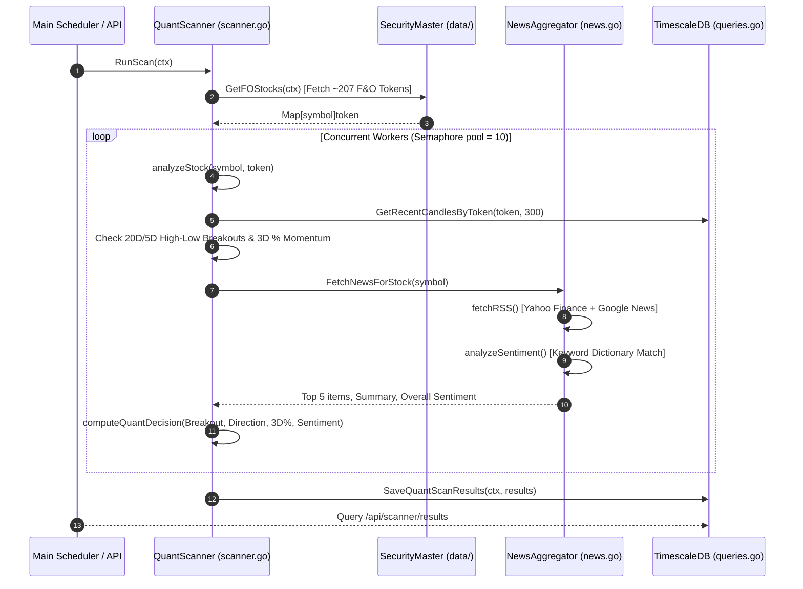

# Zerodha Automated Intraday Trading Bot

Production-grade Go implementation of an algorithmic intraday trading system for Zerodha Kite Connect API.

## Architecture

### Components

- **Data Layer** (`data/`): WebSocket ticker, OHLCV candle aggregation, security master, time-series database
- **Strategy Layer** (`strategy/`): Technical indicators (VWAP, ATR, RSI), signal generation engine
- **Execution Layer** (`execution/`): Order placement, status tracking, resilient API wrapper
- **Risk Management** (`risk/`): Capital preservation, position tracking, circuit breakers
- **Monitoring** (`monitoring/`): Structured logging, Prometheus metrics

### Key Features

✅ **Resilient**: Automatic retry with exponential backoff, circuit breaker for cascading failures  
✅ **Real-time**: WebSocket ticker, 5-minute candle aggregation, sub-second latency  
✅ **Safe**: Dynamic SL with ATR, capital preservation, daily loss limits, margin monitoring  
✅ **Observable**: Prometheus metrics, structured logging (JSON), order tracking  
✅ **Web Dashboard**: Interactive real-time candlestick charts with execution trade markers and dynamic tooltips
✅ **Modular**: Clean separation of concerns, easy to extend strategies  

## Prerequisites

- Go 1.24+
- PostgreSQL 13+ (for TimescaleDB and caching)
- Zerodha Kite Connect API credentials

## Setup

### 1. Environment Configuration

```bash
cp .env.example .env
```

Edit `.env`:

```env
# Zerodha Kite API
KITE_API_KEY=your_api_key
KITE_API_SECRET=your_api_secret
KITE_USER_ID=your_user_id
KITE_ACCESS_TOKEN=your_access_token

# Database
DB_HOST=localhost
DB_PORT=5432
DB_USER=postgres
DB_PASSWORD=your_password
DB_NAME=zerodha_trading
DB_SSL_MODE=disable


# Trading
INITIAL_CAPITAL=500000
MAX_TRADES_PER_DAY=20
MAX_LOSS_STREAKS=3
MAX_HOLDING_TIME_MIN=30
MAX_CAPITAL_PER_TRADE=20000.0
MAX_DAILY_LOSS_AMOUNT=10000.0

# Monitoring
LOG_LEVEL=info
```

### 2. Database Setup

```bash
# Create database and enable TimescaleDB
createdb zerodha_trading
psql zerodha_trading -c "CREATE EXTENSION IF NOT EXISTS timescaledb;"
```

### 3. Dependencies

```bash
go mod download
go mod tidy
```

### 4. Build & Run

```bash
go build -o trading-bot
./trading-bot
```

### 5. Seeding Historical Data

To seed 1 week of historical 1-minute and 5-minute candles for all Nifty 50 instruments into the database, run:

```bash
go run scripts/seed/main.go
```

* **Live Mode**: If a valid `KITE_ACCESS_TOKEN` is configured in `.env`, the script will query Zerodha's `/historical` API to load real historical candles.
* **Mock Mode**: If no access token is set, it automatically falls back to generating a high-fidelity procedural simulation.

## Interactive Web Dashboard

The application features an embedded, high-performance web dashboard to track trades, monitor watchlist tickers, and visualize live intraday charts.

### 🌐 Accessing the Dashboard

Once the application container starts, open your browser and navigate to:
👉 **`http://localhost:8080/zt`**

*(Note: Navigating to the root `http://localhost:8080/` automatically redirects you to `/zt` via a `301 Moved Permanently` header).*

### 📊 Key Dashboard UI Features

1. **Intraday Candlestick & Volume Chart**:
   - Renders 5-minute OHLCV candles using TradingView's high-performance **Lightweight Charts** library.
   - Restricts transaction volume to the bottom 20% overlay pane.
   - Automatically centers and fits visible candles on symbol load via `fitContent()`.

2. **Trade Markers**:
   - Buy entries are marked with a blue **Up Arrow** below the entry candle.
   - Sell entries are marked with a pink **Down Arrow** above the entry candle.
   - Exact entry and exit prices are displayed on the markers.

3. **Dynamic Watchlist Dropdown**:
   - The dropdown list automatically syncs with the trading engine. It displays only active, subscribed watchlist symbols.

4. **Return Metric Hover Tooltips**:
   - Hovering over the percentages in the **Daily Net P&L** card triggers tooltips detailing:
     - **Margin Return**: Return on leveraged capital locked.
       $$\text{Margin Return \%} = \frac{\text{Net P\&L}}{\text{Total Trade Value} / 5} \times 100$$
     - **Account Growth**: Return on entire portfolio size.
       $$\text{Account Growth \%} = \frac{\text{Net P\&L}}{\text{INITIAL\_CAPITAL}} \times 100$$

### ⚙️ Manual Day Overrides & Pre-Market Controls (from 09:00 AM)

The dashboard features a **Daily Watchlist Selections** console tab where users can manage watchlist stocks, assign customized strategies, and control trade eligibility starting from **09:00:00 AM IST**.

1. **Pre-Market 09:00 AM Trading & Strategy Tagging**:
   - Users can input comma-separated stock symbols with optional strategy tags (e.g. `AMBER:NEWS, IDFCFIRSTB:NEWS, SBIN:PDH_PDL`).
   - Manual stocks are immediately registered on startup/input, subscribed for live WebSocket streaming, and preserved across restarts with distinctive amber badges (`FO+SEC+NEWS` / `MA`).
   - Configurable via `STOCK_SELECT_TIME` (default `09:00:00`) and UI Settings toggle **Consider Manual Stocks from 09:00 AM**.

2. **Dynamic Watchlist Recalculation**:
   - The UI includes a **`⚡ Recalculate Watchlist`** button that triggers `POST /api/watchlist/recalculate`.
   - Bypasses cached daily watchlist checks (`force=true`) to dynamically re-screen the entire F&O and Sector momentum universe, merging them seamlessly with active manual stocks.

3. **Active Selected Sectors & Live Timestamps**:
   - The UI sidebar and mobile drawer feature a real-time **Selected Sectors** widget displaying top gaining/declining sectors with exact execution timestamps (`Selected at HH:MM:SS IST`).
   - Automatically cleans previous selections for the day (`ClearSelectedSectors`) so only the top active sectors (default: 2) are displayed.

4. **Stock Trade Eligibility & Actions**:
   - Each stock in the Daily Watchlist Selections tab displays its current eligibility status (**`ELIGIBLE`** or **`EXCLUDED`**).
   - Users can **Delete** (exclude) or **Restore** stocks for trading directly from the table.
   - Clicking any stock row loads its complete candlestick, volume, EMA, and PDH/PDL technical chart data on the canvas.

5. **Toast Notification Engine**:
   - Modern non-blocking overlay toasts auto-dismiss in 2 seconds upon configuration updates or stock additions.

## Modular Strategy Architecture

The bot features a modular multi-strategy execution framework. Multiple strategies can run concurrently on incoming live tick feeds and candle closes, configurable dynamically via environment variables. Executed orders and completed trades are saved in the database with their originating strategy name (e.g. `LOW_VOLUME`, `VANDE_BHARAT`) for tracking and analysis.

### Active Strategies Configuration
Set the enabled strategies in your `.env` file using the `ACTIVE_STRATEGIES` key (comma-separated):
```env
ACTIVE_STRATEGIES=LOW_VOLUME,VANDE_BHARAT
```

---

## Strategy 1: Low-Volume Breakout (`LOW_VOLUME`)

The bot executes a high-fidelity **Low-Volume Breakout Strategy** designed to identify intraday consolidation ranges and capitalize on explosive momentum expansions.

### 1. 1st Candle Qualification & Reference Levels
* **PDH & PDL Binding**: Dynamically queries Previous Day High (PDH) and Low (PDL) from TimescaleDB cache for each watchlist symbol.
* **1st Candle Qualification (09:15 AM IST Only)**:
  * **Strict 09:15 Anchor**: The 1st candle MUST have an exact timestamp of **`09:15 AM IST`**. If a stock is added mid-morning and the 09:15 AM candle is missing, trade execution is strictly blocked.
  * **BUY Qualified**: The 1st 5-minute candle of the day MUST close **above PDH** (`1st_Candle.Close > PDH`).
  * **SELL Qualified**: The 1st 5-minute candle of the day MUST close **below PDL** (`1st_Candle.Close < PDL`).
  * **Disqualification**: If the 1st candle closes inside the previous day's range (`PDL ≤ Close ≤ PDH`), the symbol is disqualified from taking any LOW VOLUME trades today.

### 2. Trade Setup & Trigger Constraints (Strict Option A)
* **Strict Day's Lowest Volume Setup**: The Setup Candle is defined strictly as the completed 5-minute candle with the **absolute lowest trading volume of the entire session** since 09:15 AM IST.
  * **BUY Entry**: Setup Candle must be **RED** (`Close < Open`). Triggered when live LTP breaks above Setup High (`LTP > Setup.High`).
  * **SELL Entry**: Setup Candle must be **GREEN** (`Close > Open`). Triggered when live LTP breaks below Setup Low (`LTP < Setup.Low`).
* **Single Immediate Next-Candle Window**: A breakout is **ONLY valid during the single 5-minute candle immediately following the lowest-volume setup candle**. If no breakout occurs on that immediate next candle, the setup expires. No trade can ever be taken on later, higher-volume candles unless a new record lowest-volume candle forms.
* **Unconditional Database Catch-Up Fallback**: When stocks are added dynamically mid-morning, if Zerodha API rate limits (`HTTP 429`), the bot automatically backfills morning candles from PostgreSQL `candles_5m`, guaranteeing strategy memory always knows the true day's lowest volume candle.
* **Operational Window**: Trading activity starts strictly after **09:30:01 AM IST** (ignoring the first 3 morning 5m candles). Breakouts prior to 09:30 AM are ignored.

---

## Strategy 2: Refined Vande Bharat Setup (`VANDE_BHARAT`)

The **Refined Vande Bharat** strategy implements a high-performance momentum breakout model checking previous day high/low references, master/confirmation candles, opening gaps relative to Yesterday's Close, 2nd candle SL range control, and any-color confirmation breakouts.

### 1. Daily Setup-Driven Stock Selection
* **Sector & Stock Selection**: Unbiased selection scans F&O sectors and populates stocks matching breakout directions.
* **Previous Day Reference**: Dynamically queries Previous Day High (PDH), Previous Day Low (PDL), and Yesterday's Close from TimescaleDB cache.

### 2. Strategy Setup & Trigger Constraints (5 Institutional Rules)
* **Operational Window**: Trading activity runs strictly from **09:25:01 AM IST** (after ignoring the 1st two 5m morning candles).
* **Master Candle (Rule 1)**: Must be the **1st 5-minute candle of the day** (09:15 AM IST):
  * **2.0% Opening Gap from Yesterday's Close**: Opening price must gap up/down by at least 2.0% relative to **Yesterday's Close price** (`(Open - YesterdayClose) / YesterdayClose * 100 >= 2.0%` for BUY, `(YesterdayClose - Open) / YesterdayClose * 100 >= 2.0%` for SELL, configurable via `VB_MIN_GAP_PCT`).
  * **BUY Master**: 1st candle `Close > PDH` and `Close > Open` (Green body).
  * **SELL Master**: 1st candle `Close < PDL` and `Close < Open` (Red body).
  * **Max 40% Wick (Rule 4)**: Total wicks (upper + lower) must account for $\le 40\%$ of candle range (body $\ge 60\%$).
  * **Max Range**: Total candle range $\le 1.8\%$ of stock price (`VB_MASTER_MAX_PCT`).
* **2nd Candle (09:20 AM) SL Anchor & Range Control (Rule 5)**:
  * The Stop-Loss anchor is locked to the 2nd 5-minute candle (Low for BUY, High for SELL).
  * The 2nd candle range % `(High - Low) / Close * 100` MUST be strictly between **0.5%** (`VB_SL_MIN_PCT`) and **1.0%** (`VB_SL_MAX_PCT`). If outside this band, the setup is immediately invalidated to prevent taking trades with unpredictable risk.
* **Strict Intermediate Consolidation (Rule 3a)**:
  * All intermediate candles prior to confirmation must stay strictly **INSIDE** the Master Candle range `[Master.Low, Master.High]`.
  * If price breaches the opposite side (Master Low broken in BUY setup, or Master High broken in SELL setup), the setup is immediately invalidated.
* **Any-Color Confirmation Candle (Rule 3b)**:
  * The first candle breaking the Day High (Master High for BUY) or Day Low (Master Low for SELL) qualifies as the Confirmation Candle.
  * Confirmation candle can be of **ANY COLOR** (Green, Red, or Doji).
* **Entry Day Move Constraint (Rule 2)**:
  * When live tick LTP triggers the breakout, the stock's price move relative to the breakout reference level (PDH / PDL) must be $\le \text{Master Candle Max Range (\%)} (\le 1.8\%)$:
    - **BUY Setup**: `(LTP - PDH) / PDH * 100 <= 1.8%`
    - **SELL Setup**: `(PDL - LTP) / PDL * 100 <= 1.8%`

---

## Strategy 3: Triple SuperTrend Multi-Index Options Selling Strategy (`OPTIONS_SUPERTREND`)

The **Triple SuperTrend Options Selling Strategy** executes autonomous Out-Of-The-Money (OTM) option selling based on 5-minute Triple SuperTrend trend direction across multiple configured indices dynamically via `OPTIONS_ACTIVE_INDICES` (e.g. `NIFTY 50`, `BANKNIFTY`, `SENSEX`, `FINNIFTY`, `MIDCPNIFTY`).

### 1. Indicator Setup & Directional Rules
* **Multi-Index Support**: Operates concurrently on all active indices configured in `.env` (`OPTIONS_ACTIVE_INDICES=NIFTY 50,BANKNIFTY,SENSEX`):
  - **NIFTY 50**: Token `256265`, Spot `NSE`, Opts `NFO`, Lot `65`, Step `50`, Expiry: Last Thursday
  - **BANK NIFTY**: Token `260105`, Spot `NSE`, Opts `NFO`, Lot `15`, Step `100`, Expiry: Last Thursday
  - **BSE SENSEX**: Token `265`, Spot `BSE`, Opts `BFO`, Lot `20`, Step `100`, Expiry: Last Friday
  - **FINNIFTY**: Token `257801`, Spot `NSE`, Opts `NFO`, Lot `65`, Step `50`, Expiry: Last Tuesday
  - **MIDCPNIFTY**: Token `288009`, Spot `NSE`, Opts `NFO`, Lot `120`, Step `25`, Expiry: Last Monday
* **Indicators**: Calculates 3 SuperTrend lines on 5-minute index candles:
  - `ST1 (10, 4.0)` | `ST2 (7, 3.0)` | `ST3 (7, 2.0)`
* **Completed Candle Confirmation**: Signal evaluation evaluates **ONLY fully completed closed 5-minute candles** (`cTime <= nowFloored - 5m`), completely excluding live forming mid-candles to prevent false mid-candle entries or signals.
* **Trend Decision**:
  - **`BULLISH`**: Completed Candle Close > All 3 SuperTrends $\rightarrow$ Sell **`PE`** (Put Option) OTM below spot targeting entry premium.
  - **`BEARISH`**: Completed Candle Close < All 3 SuperTrends $\rightarrow$ Sell **`CE`** (Call Option) OTM above spot targeting entry premium.
* **Chart Signal Markers**: Signal arrows render strictly on candles where an actual trade entry or exit occurred (or combined single-candle reversal `EXIT & SELL PE/CE`).
* **Database IST Timezone**: All order entry, exit, and position timestamps are recorded directly using PostgreSQL server clock (`NOW() AT TIME ZONE 'Asia/Kolkata'`).

### 2. Execution & Risk Rules
* **Dynamic Exchange Routing**: SENSEX options route automatically to **`BFO`**; NIFTY, BANKNIFTY, FINNIFTY, and MIDCPNIFTY route to **`NFO`**.
* **Base Lot Sizes**: Dynamic per index (`65` for NIFTY/FINNIFTY, `15` for BANKNIFTY, `20` for SENSEX, `120` for MIDCPNIFTY).
* **Target Entry Premium Selection**: Scans candidate OTM strikes to select the contract symbol nearest to target premium (default ₹100.0 for NIFTY, ₹200.0 for BANKNIFTY/SENSEX).
* **Monthly Expiry & 7-Day Roll-Over**: Trades Monthly Expiry option contracts (`OPTIONS_EXPIRY_TYPE=MONTHLY`). When $\le 7$ days remain before current month expiry (`OPTIONS_NEXT_MONTH_DAYS=7`), automatically rolls over to the **Next Month's Expiry** contract.
* **Multi-Stage Lot Scaling**: 1x Lot for initial entry, scaling to 2x Lot on trend reversals. Resets back to 1x Lot on day boundary.
* **Stop-Loss Target**: Initial 50% option premium increase (`OPTIONS_SL_PCT=50.0`).
* **Option Price Chart SuperTrend Trailing SL (5% Buffer)**: Evaluates Triple SuperTrend directly on the 5-minute candle price chart of the selected option contract (`OPTIONS_TRAIL_SL_BUFFER_PCT=5.0`). For Short Option positions, candidate SL is placed 5% above the highest SuperTrend resistance band ($\max(\text{ST1}, \text{ST2}, \text{ST3}) \times 1.05$). When option premium decays in our favour, the SL ratchets down; on adverse bounces or pauses, the SL remains strictly constant (never loosens).
* **Last New Trade Cutoff**: No new trade entries are allowed after `OPTIONS_LAST_NEW_TRADE_TIME` (default **15:00 IST** / **03:00 PM IST**).
* **Intraday Cutoff**: Positions are auto squared off at `OPTIONS_AUTO_SQUARE_OFF_TIME` (default **15:14 IST**).
* **API Order Compliance**: Uses aggressive limit orders (5% below LTP for SELL, 5% above LTP for BUY) to guarantee instant fills compliant with Zerodha API protection policies.

---

## Strategy 4: Fake Breakout Strategy (`FAKE_BREAKOUT`)

The **Fake Breakout Strategy** exploits opening gap exhaustion (4.0% to 8.0%) where aggressive opening retail momentum gets trapped on oversized opening gaps, triggering an immediate fade reversal.

### 1. Opening Gap Constraints (09:15 AM IST)
* **SELL Setup**: Opens above Yesterday's Close / PDH with Gap Up between **4.0% and 8.0%** (`4.0% <= GapUp <= 8.0%`, configurable via `FB_GAP_UP_MIN_PCT` and `FB_GAP_UP_MAX_PCT`).
* **BUY Setup**: Opens below Yesterday's Close / PDL with Gap Down between **4.0% and 8.0%** (`4.0% <= GapDown <= 8.0%`, configurable via `FB_GAP_DOWN_MIN_PCT` and `FB_GAP_DOWN_MAX_PCT`).

### 2. Master & Confirmation Candles
* **Master Candle (1st Candle 09:15 AM IST)**:
  * **SELL Setup**: Must close **RED** (`Close < Open`) with Upper + Lower wicks $\le 40\%$ (`FB_MASTER_MAX_WICK_PCT`).
  * **BUY Setup**: Must close **GREEN** (`Close > Open`) with Upper + Lower wicks $\le 40\%$ (`FB_MASTER_MAX_WICK_PCT`).
* **Confirmation Candle (2nd Candle)**:
  * **SELL Setup**: Must close **RED** (`Close < Open`), break Master Low (`Low < Master.Low`), and range $\le 1.0\%$ (`(High - Low) / Close * 100 <= 1.0%`).
  * **BUY Setup**: Must close **GREEN** (`Close > Open`), break Master High (`High > Master.High`), and range $\le 1.0\%$ (`(High - Low) / Close * 100 <= 1.0%`).

### 3. Trade Execution & Risk Rules
* **Entry Window**: Entries permitted strictly starting from the **3rd candle onward** (`candle_count >= 3`) until `FB_TRADE_END_TIME` (default `11:00:00 IST`).
* **SELL Trigger**: Live tick `LTP <= Confirmation.Low`. Stop-Loss is fixed at **2nd Candle High** (`Confirmation.High * (1 + SLBufferPct)`).
* **BUY Trigger**: Live tick `LTP >= Confirmation.High`. Stop-Loss is fixed at **2nd Candle Low** (`Confirmation.Low * (1 - SLBufferPct)`).
* **Position Sizing**: Governed by attached Risk-Reward engine and sized via `RiskPerTrade`.
* **Timeframe**: Configurable to **`1m` (Default)** or **`5m`** via UI.

---

## Strategy 5: Vande Bharat Trap Strategy (`VANDE_BHARAT_TRAP`)

The **Vande Bharat Trap Strategy** capitalizes on opening false breakouts where the 1st candle breaks Previous Day High (PDH) or Low (PDL) but closes with an opposite body color (Fake Master), trapping counter-trend retail participants. When price subsequently breaches the Fake Master extreme, a genuine Vande Bharat Master candle is established, triggering high-probability momentum breakouts.

### 1. Fake Master Candle (09:15 AM IST)
* **BUY Setup**: 1st candle closes **above PDH** (`Close > PDH`), body must be **RED** (`Close < Open`), and range $\le 3.0\%$ (`VBT_FAKE_MASTER_MAX_PCT`).
* **SELL Setup**: 1st candle closes **below PDL** (`Close < PDL`), body must be **GREEN** (`Close > Open`), and range $\le 3.0\%$ (`VBT_FAKE_MASTER_MAX_PCT`).

### 2. Genuine Master & 2nd Candle SL Anchor
* **Master Formation**: Subsequent candle breaking **Fake Master High** (for BUY) or **Fake Master Low** (for SELL) establishes the **Vande Bharat Master Candle** (`MasterMaxPct` $\le 1.8\%$, `MasterMaxWickPct` $\le 40\%$).
* **2nd Candle SL Anchor**: The single candle immediately following Master must have range between **0.5% and 1.0%** (`VBT_SL_MIN_PCT` to `VBT_SL_MAX_PCT`). Low (BUY) or High (SELL) is locked as Stop-Loss.

### 3. Inside Consolidation & Live Breakout
* **Inside Consolidation**: Intermediate candles must stay strictly inside $[\text{Master.Low}, \text{Master.High}]$.
* **Confirmation Candle**: First candle breaking Day High (BUY) or Day Low (SELL) qualifies as Confirmation (can be of **ANY COLOR**).
* **Live Breakout Trigger**: Live tick breaks Confirmation High (BUY) or Low (SELL) with price move from PDH/PDL $\le 1.8\%$ before `VBT_TRADE_END_TIME` (default `11:00:00 IST`).
* **Timeframe**: Configurable to **`1m` (Default)** or **`5m`** via UI.

---

## Strategy 6: EMA S5 Breakout Strategy (`EMAS5_BREAKOUT`)

The **EMA S5 Breakout Strategy** combines dynamic Exponential Moving Averages (**EMA 10** and **EMA 20**), 5-candle trend sequences, oval curvature rebound filtering ($\ge 0.5\%$), and Previous Day High/Low support/resistance levels.

### 1. Rolling Indicator Buffer & Rally Sequence
* **100-Candle Buffer**: Maintains a rolling buffer of 100 closed candles per stock for smooth and non-repainting EMA 10 & 20 indicator computation.
* **Rally Sequence ($\ge 5$ Candles)**:
  * **BUY Setup**: $\ge 5$ continuous closed candles of any color forming **Higher Lows** ($\text{Low}_i \ge \text{Low}_{i-1} \times (1 - \text{Buffer} 0.2\%)$).
  * **SELL Setup**: $\ge 5$ continuous closed candles forming **Lower Highs** ($\text{High}_i \le \text{High}_{i-1} \times (1 + \text{Buffer} 0.2\%)$).

### 2. Oval Rebound Move ($\ge 0.5\%$) & Master Formation
* **Oval / U-Shaped Curve Move**: Price must rebound $\ge 0.5\%$ (configurable in UI) from the sequence lowest low to the Master candle close (for BUY), or drop $\ge 0.5\%$ from sequence highest high to Master close (for SELL).
* **Master Level Touch & Close**:
  * **BUY Master**: GREEN candle (`Close > Open`) that touches EMA 10, EMA 20, or PDH and closes above all 3 levels with Range $\le 2.0\%$ (`ES5_MASTER_MAX_PCT`).
  * **SELL Master**: RED candle (`Close < Open`) that touches EMA 10, EMA 20, or PDL and closes below all 3 levels with Range $\le 2.0\%$.
* **Master Extreme Invalidation**: Breaching Master Low (for BUY) or Master High (for SELL) immediately cancels the setup.

### 3. Confirmation & Trade Execution
* **Inside Consolidation**: Allows maximum 1 inside candle (`ES5_MAX_INSIDE_CANDLES`) between Master and Confirmation.
* **Confirmation Candle**: Breaks Master High (for BUY) or Master Low (for SELL) with Range $\le 1.0\%$ (`ES5_CONFIRM_MAX_PCT`).
* **Live Breakout Trigger**: Live tick triggers BUY at `LTP >= Confirmation.High` (SL at Confirmation Low) or SELL at `LTP <= Confirmation.Low` (SL at Confirmation High) before `ES5_TRADE_END_TIME` (default `11:00:00 IST`).
* **Trade Frequency**: Enforces maximum **2 trades per stock per day** (configurable in UI via `ES5_MAX_TRADES_PER_STOCK`).
* **Timeframe**: Configurable to **`1m` (Default)** or **`5m`** via UI.

---

## Stop-Loss & Target Management (All Strategies)
* **Risk Per Trade Position Sizing Formula**:
  The bot calculates the exact trade quantity dynamically according to user-configured **Risk Per Trade** (e.g. ₹500.0) and Stop-Loss distance ($R_{\text{distance}} = |P_{\text{entry}} - P_{\text{SL}}|$):
  $$\text{Quantity} = \min\left( \left\lfloor \frac{\text{Risk Per Trade}}{R_{\text{distance}}} \right\rfloor, \left\lfloor \frac{\text{Capital Pool}}{\text{Margin Per Share}} \right\rfloor \right)$$
  Where:
  * $\text{Margin Per Share} = P_{\text{entry}} / 5$ (for 5x intraday MIS leverage).
  * $\text{Max Loss if SL Hit} = \text{Quantity} \times R_{\text{distance}} \le \textbf{Risk Per Trade}$.
* **Risk Buffer**: The initial trade risk is buffered to prevent stops from triggering on market noise:
  * **Low Volume Breakout**: Uses a 0.1% buffer (configurable via UI `sl_buffer_pct`).
  * **Vande Bharat Breakout**: Uses a 0.1% buffer (configurable via UI `sl_buffer_pct`).
  * **Fake Breakout Trap**: Uses a 0.1% buffer (configurable via UI `sl_buffer_pct`).
  * **Vande Bharat Trap**: Uses a 0.1% buffer (configurable via UI `sl_buffer_pct`).
* **Stop-Loss (SL)**: Set at $\text{Entry} - \text{Buffered Risk}$ (for Long) or $\text{Entry} + \text{Buffered Risk}$ (for Short).
* **Target 1 (1:2 R:R)**: Set at $\text{Entry} + (\text{Buffered Risk} \times \text{RISK\_REWARD\_RATIO})$ (for Long) or $\text{Entry} - (\text{Buffered Risk} \times \text{RISK\_REWARD\_RATIO})$ (for Short).
* **Exit Scaling**:
  1. Once **Target 1** is hit, **50% of the position** is closed immediately at market price.
  2. The Stop-Loss for the remaining 50% of the position is moved to the **Entry Price** (breakeven cost-to-cost).
  3. If the remaining position is not stopped out, it is held until the market-close hard square-off override (configured by `AUTO_SQUARE_OFF_TIME`, default **03:20 PM IST**).
* **Partial Entry Fills**:
  If an entry order is cancelled (either due to candle window timeout or manually) and has a partial fill (`FilledQuantity > 0`):
  1. The bot does **not** close the trade; instead, it accepts the filled amount as the active position size.
  2. The position quantity in the Risk Manager is updated to the actual filled quantity.
  3. A broker-side Stop-Loss order is placed (or tracked internally) for the **updated quantity** at the precalculated SL price.
  4. The trade continues to execute normally.

---

## Analytical Suite: Intraday Expected Move & Option Delta Engine (`EXPECTED_MOVE`)

The application includes a real-time mathematical expected move and option sensitivity calculator available under the **`🎯 Expected Move`** dashboard tab and accessible via HTTP GET `/api/options/expected-move`.

### 1. Key Mathematical Models
* **India VIX Daily Volatility Range**:
  $$\text{Daily \% Move} = \frac{\text{India VIX}}{\sqrt{365}}$$
  $$\text{Daily Points} = \text{Spot Price} \times \text{Daily \% Move}$$
  $$\text{Remaining Intraday Move} = \text{Daily Points} \times \sqrt{\frac{H_{\text{remaining}}}{6.25}}$$
* **ATM Straddle Market Maker Bounds**:
  $$\text{ATM Strike} = \text{Round}\left(\frac{\text{Spot}}{50}\right) \times 50$$
  $$\text{Market Maker Expected Move} = 0.85 \times \text{ATM Straddle Price (CE + PE)}$$
* **Option Sensitivity (Black-Scholes Delta & Theta)**:
  * **Delta ($\Delta$)**: Evaluated dynamically based on strike moneyness ($0.50$ ATM, $0.12$ to $0.88$ for OTM/ITM).
  * **Theta ($\Theta$)**: Time-decay loss per hour $\frac{-(\text{LTP} \times 0.04)}{H_{\text{remaining}}}$.
  * **Premium Shift Table**: Instant projected contract prices for $+50$, $+100$, $-50$, and $-100$ point index shifts.

### 2. Strict Live Data Mandate
* All market inputs (NIFTY 50 Spot, India VIX Index, ATM Straddle Quotes, Option Contract LTP) are fetched **strictly from live Zerodha REST/WebSocket APIs** (`tb.kiteClient.GetQuote`), or if unquoted, queried directly from PostgreSQL database table `candles_5m`. Zero static price fallbacks or assumptions are permitted.

---

## Risk Framework

| Parameter | Default Value | Description |
| :--- | :--- | :--- |
| `ACTIVE_STRATEGIES` | `LOW_VOLUME,VANDE_BHARAT,OPTIONS_SUPERTREND` | Comma-separated list of active strategies to execute |
| `LV_CANDLE_TIMEFRAME` | `5m` | Configurable candle timeframe for Low Volume Breakout (`1m` / `5m`) |
| `VB_CANDLE_TIMEFRAME` | `1m` | Configurable candle timeframe for Vande Bharat Momentum (`1m` / `5m`) |
| `FB_CANDLE_TIMEFRAME` | `1m` | Configurable candle timeframe for Fake Breakout (`1m` / `5m`) |
| `VBT_CANDLE_TIMEFRAME` | `1m` | Configurable candle timeframe for Vande Bharat Trap (`1m` / `5m`) |
| `VBT_FAKE_MASTER_MAX_PCT` | `3.0%` | Max range % for 1st Fake Master candle (09:15 AM) |
| `VBT_MASTER_MAX_PCT` | `1.8%` | Max range % for Master candle and price move from PDH/PDL |
| `VBT_SL_MIN_PCT` | `0.5%` | Min range % for 2nd candle (SL Anchor) |
| `VBT_SL_MAX_PCT` | `1.0%` | Max range % for 2nd candle (SL Anchor) |
| `VBT_MASTER_MAX_WICK_PCT` | `40.0%` | Max upper + lower wick % for Master candle |
| `RISK_PER_TRADE` | `₹500.0` | Maximum currency loss allocated per single trade (`Quantity = floor(Risk / SL_Distance)`) |
| `INITIAL_CAPITAL` | `₹1,00,000` | Base portfolio size |
| `OPTIONS_ACTIVE_INDICES` | `NIFTY 50,BANKNIFTY,SENSEX,FINNIFTY,MIDCPNIFTY` | Comma-separated active indices to trade concurrently |
| `OPTIONS_LIVE_INDICES` | `(empty)` | Comma-separated indices for LIVE broker trading (unlisted run in PAPER mode, 'ALL' for all) |
| `BOT_RESTART_ALLOWED_BEFORE` | `09:15` | Pre-market cutoff time (IST) for UI bot restarts |
| `BOT_RESTART_ALLOWED_AFTER` | `15:45` | Post-market cutoff time (IST) for UI bot restarts (locked during market hours) |
| `SUPERTREND_ST1_FACTOR` | `4.0` | Multiplier for SuperTrend 1 (ST1: 10, 4.0) |
| `SUPERTREND_ST2_FACTOR` | `3.0` | Multiplier for SuperTrend 2 (ST2: 7, 3.0) |
| `SUPERTREND_ST3_FACTOR` | `2.0` | Multiplier for SuperTrend 3 (ST3: 7, 2.0) |
| `OPTIONS_BASE_LOT_SIZE` | `65` | Default base option lot size in quantity (1x Lot = 65 Qty) |
| `OPTIONS_MAX_QUANTITY_MULTIPLIER` | `4` | Maximum lot size multiplier cap for options trading |
| `OPTIONS_LAST_NEW_TRADE_TIME` | `14:32` | Cutoff time (IST) after which no new option trades are taken |
| `OPTIONS_AUTO_SQUARE_OFF_TIME` | `15:13` | EOD auto square-off cutoff time (IST) for options |
| `OPTIONS_SL_PCT` | `50.0` | Option stop-loss percentage (50% premium increase) |
| `OPTIONS_LIVE_TRADING` | `false` | Enable live option execution on Zerodha exchange |
| `AUTO_SQUARE_OFF_TIME` | `15:20` | Dynamic market-close hard square-off time (IST) for equity |
| `MAX_CAPITAL_PER_TRADE` | `₹20,000` | Max cash allocation per trade setup |
| `MAX_DAILY_LOSS_AMOUNT` | `₹10,000` | Max portfolio loss limit (Circuit breaker) |
| `MAX_LOSS_STREAKS` | `3` | Stop trading after N consecutive losses |
| `MAX_HOLDING_TIME_MIN` | `30` | Max holding time minutes for MIS positions |
| `MAX_TRADES_PER_DAY` | `20` | Maximum total executions per session |
| `STRATEGY_WATCHLIST_SIZE` | `10` | Target watchlist portfolio size per strategy |
| `WATCHLIST_MAX_PCT_CHANGE` | `100.0%` | Max percentage change to allow watchlist inclusion |

## API Endpoints

### Monitoring

---

## 🎯 Quant Stock & News Scanner (`QUANT_SCANNER`)

The application includes a production-grade **Quant Stock & News Scanner** located in [`scanner/`](file:///C:/Users/Dell/OneDrive/Desktop/cz/zt/scanner) that scans all ~207 F&O constituent stocks concurrently to generate intraday/swing trading signals powered by technical breakouts and real-time news sentiment.

---

### 1. News RSS Aggregation & Recency Window

The news engine ([`scanner/news.go`](file:///C:/Users/Dell/OneDrive/Desktop/cz/zt/scanner/news.go)) collects financial news headlines dynamically without requiring paid third-party APIs:

* **Sources**:
  1. **Yahoo Finance RSS**: `https://finance.yahoo.com/rss/headline?s=<SYMBOL>.NS`
  2. **Google News RSS (Fallback/Augment)**: `https://news.google.com/rss/search?q=<SYMBOL>+stock+India&hl=en-IN&gl=IN&ceid=IN:en`
* **Item Cap & Recency**:
  - RSS feeds return items sorted by publication date (`pubDate`).
  - The engine limits context to the **top 5 most recent live headlines** per stock.
  - Depending on company news frequency, these 5 headlines represent news published over the **last 1 to 3 days (24 to 72 hours)**.

---

### 2. Headline Sentiment Analysis Engine

In [`scanner/news.go`](file:///C:/Users/Dell/OneDrive/Desktop/cz/zt/scanner/news.go#L129), `analyzeSentiment(text string)` classifies every headline by evaluating financial domain keywords:

* **Bullish Keywords (+1 point each)**:
  `profit`, `surge`, `gain`, `upgrade`, `order`, `rally`, `growth`, `record`, `expansion`, `bullish`, `jump`, `high`, `buy`, `outperform`, `revenue`, `dividend`, `acquisition`, `win`, `approval`
* **Bearish Keywords (-1 point each)**:
  `loss`, `fall`, `drop`, `downgrade`, `penalty`, `slump`, `decline`, `bearish`, `plunge`, `low`, `sell`, `underperform`, `investigation`, `strike`, `fraud`, `warning`, `cut`, `default`
* **Aggregate Classification**:
  - If $\text{Positive Headlines} > \text{Negative Headlines} \rightarrow$ Overall Sentiment = **`POSITIVE`**
  - If $\text{Negative Headlines} > \text{Positive Headlines} \rightarrow$ Overall Sentiment = **`NEGATIVE`**
  - Otherwise $\rightarrow$ Overall Sentiment = **`NEUTRAL`**

---

### 3. Quantitative Decision Engine & Scoring Model

In [`scanner/scanner.go`](file:///C:/Users/Dell/OneDrive/Desktop/cz/zt/scanner/scanner.go#L277), `computeQuantDecision()` calculates a **Quant Confidence Score (0.0 to 100.0)** starting from a base score of **50.0**:

$$\text{Confidence Score} = 50.0 + \text{Breakout Weight} + (\text{3-Day \% Change} \times 3.5) + \text{News Sentiment Weight} + \text{Volume Surge Bonus}$$

#### Mathematical Weighting Breakdown:

| Factor | Condition | Score Adjustment | Weight Contribution |
| :--- | :--- | :--- | :--- |
| **Technical Breakout** | `MONTHLY_HIGH_BREAK` ($\ge$ 20-Day High) | $+25.0$ pts | **40%** |
| | `WEEKLY_HIGH_BREAK` ($\ge$ 5-Day High) | $+15.0$ pts | |
| | `MONTHLY_LOW_BREAK` ($\le$ 20-Day Low) | $-25.0$ pts | |
| | `WEEKLY_LOW_BREAK` ($\le$ 5-Day Low) | $-15.0$ pts | |
| **Multi-Day Momentum** | 3-Day % Price Change (`pct3D`) | $\text{pct3D} \times 3.5$ pts | **30%** |
| **News Sentiment** | News Sentiment == `POSITIVE` | $+10.0$ pts | **20%** |
| | News Sentiment == `NEGATIVE` | $-10.0$ pts | |
| **Volume Surge Multiplier** | $\text{Volume 1D} / \text{20-Day ADV} \ge 1.5x$ | $+5.0$ pts (Bull) / $-5.0$ pts (Bear) | **10%** |

#### Macro Benchmarks & Commodities (Option / Futures Signals):

* **📌 NIFTY 50 Index**:
  - Score $\ge 60.0 \rightarrow$ **`SELL PE 300-OTM (BULLISH)`**
  - Score $\le 40.0 \rightarrow$ **`SELL CE 300-OTM (BEARISH)`**
  - Score $40.1 - 59.9 \rightarrow$ **`NO OPTION SELL (NEUTRAL)`**
* **🥇 GOLD Commodity (MCX)**:
  - Score $\ge 60.0 \rightarrow$ **`BUY GOLD FUT / PE SELL`**
  - Score $\le 40.0 \rightarrow$ **`SELL GOLD FUT / CE SELL`**
  - Score $40.1 - 59.9 \rightarrow$ **`NO GOLD TRADE`**
* **🛢️ CRUDE OIL Commodity (MCX)**:
  - Score $\ge 60.0 \rightarrow$ **`BUY CRUDE FUT / PE SELL`**
  - Score $\le 40.0 \rightarrow$ **`SELL CRUDE FUT / CE SELL`**
  - Score $40.1 - 59.9 \rightarrow$ **`NO CRUDE TRADE`**

#### Action Threshold Matrix:

| Confidence Score | Quant Direction | Recommended Action | Strategy Execution |
| :--- | :--- | :--- | :--- |
| **$\ge 75.0$** | **`STRONG_BULLISH`** | `BUY_ON_DIP` | High-priority Long entry |
| **$60.0 - 74.9$** | **`BULLISH`** | `ACCUMULATE` | Standard Long entry |
| **$40.1 - 59.9$** | **`NEUTRAL`** | `WATCHLIST_ONLY` | Hold on watchlist |
| **$25.1 - 40.0$** | **`BEARISH`** | `REDUCE_LONG` | Trim existing Long positions |
| **$\le 25.0$** | **`STRONG_BEARISH`** | `SHORT_ON_RALLY` | High-priority Short entry |

---

### 4. Code-Level Execution Flow (Step-by-Step)



1. **Initialization ([`main.go`](file:///C:/Users/Dell/OneDrive/Desktop/cz/zt/main.go))**: `QuantScanner` is instantiated with `NewsAggregator`, `Database`, and `SecurityMaster`.
2. **Universe Fetching ([`scanner/scanner.go: RunScan`](file:///C:/Users/Dell/OneDrive/Desktop/cz/zt/scanner/scanner.go#L48))**: Retrieves all active F&O constituent tokens from `SecurityMaster.GetFOStocks()`.
3. **Parallel Stock Analysis ([`scanner/scanner.go: analyzeStock`](file:///C:/Users/Dell/OneDrive/Desktop/cz/zt/scanner/scanner.go#L89))**: Uses a worker pool of 10 concurrent goroutines to analyze daily candle history (60 days) and compute 20-day high/low breakouts, 3-day momentum, and range expansion.
4. **News Scraping & Parsing ([`scanner/news.go: fetchRSS`](file:///C:/Users/Dell/OneDrive/Desktop/cz/zt/scanner/news.go#L84))**: Performs HTTP GET requests to Yahoo/Google News RSS feeds, unmarshals XML into `RSSItem` structs, and extracts publication timestamps.
5. **Sentiment Scoring ([`scanner/news.go: analyzeSentiment`](file:///C:/Users/Dell/OneDrive/Desktop/cz/zt/scanner/news.go#L129))**: Evaluates each headline against positive/negative financial keyword lists and determines overall stock news sentiment.
6. **Quant Decision Synthesis ([`scanner/scanner.go: computeQuantDecision`](file:///C:/Users/Dell/OneDrive/Desktop/cz/zt/scanner/scanner.go#L244))**: Merges breakout type, price momentum %, and news sentiment into a final Quant Confidence Score and recommended action.
7. **Database Storage ([`data/queries.go: SaveQuantScanResults`](file:///C:/Users/Dell/OneDrive/Desktop/cz/zt/data/queries.go#L105))**: Upserts all scan results into the `quant_scan_results` table in TimescaleDB for persistent retrieval.
8. **REST & Web Dashboard Rendering ([`handlers.go`](file:///C:/Users/Dell/OneDrive/Desktop/cz/zt/handlers.go#L425), [`index.html`](file:///C:/Users/Dell/OneDrive/Desktop/cz/zt/index.html))**: Endpoints `/api/scanner/results` and `/api/scanner/run` expose results directly to the web UI dashboard scanner tab.

### API Endpoints

```http
GET  /api/scanner/results - Get latest F&O breakout & momentum scan results
POST /api/scanner/run     - Trigger an immediate manual scan run across all 207 F&O stocks
```

## Error Handling

| Error | Handling |
|-------|----------|
| HTTP 429 (Rate limit) | Exponential backoff |
| HTTP 401 (Auth failed) | Token refresh + retry |
| HTTP 5xx (Server error) | Retry with backoff |
| WebSocket disconnect | Auto-reconnect + fallback to polling |
| Margin call | Reduce position sizes |
| Circuit breaker | Stop trading immediately |

## Monitoring & Debugging

### Checking Logs

The application outputs structured JSON logs. You can view them using Docker:

* **Go App Logs**:
  ```bash
  docker-compose logs -f app
  ```
  *(Or stream and format them using `jq`: `docker-compose logs -f app | jq .`)*
* **All Services Logs (App + DB)**:
  ```bash
  docker-compose logs -f
  ```


### Database Queries

You can connect to the database via command line directly inside the running container:

```bash
docker exec -it zt-postgres-1 psql -U postgres -d zerodha_trading
```

To connect using external GUI clients (pgAdmin, DBeaver, TablePlus, etc.):
* **Host**: `localhost`
* **Port**: `5432`
* **Database Name**: `zerodha_trading`
* **Username**: `postgres`
* **Password**: `trading_password`

Useful SQL queries inside `psql`:

```sql
-- View instrument metadata cache (which replaced Redis)
SELECT key, updated_at, LEFT(value, 100) AS preview FROM metadata_cache;

-- Recent trades and P&L
SELECT * FROM trades ORDER BY created_at DESC LIMIT 10;

-- Candles for analysis
SELECT * FROM candles_5m WHERE token = 100000 ORDER BY time DESC LIMIT 50;

-- Open positions
SELECT * FROM positions WHERE closed_at IS NULL;
```

## Performance Tuning

### Latency Optimization

- Use PostgreSQL metadata table for instrument master caching
- Connection pooling (25 max conns)
- Async order processing

### Throughput

- 1000+ ticks/second processing
- Sub-100ms candle completion
- Parallel order status polling

## Compliance & Risk

⚠️ **IMPORTANT**: This is a high-frequency trading system. Ensure:

1. You have proper regulatory approval
2. Capital is from dedicated trading account
3. All trades are tracked for tax/audit
4. Broker margin requirements are met
5. Stop-losses are always in place

## Testing

```bash
go test ./...
```

Mock ticker runs on startup for testing without live data.

## Architecture Diagram

```
┌─────────────────────────────────────────┐
│         Zerodha Kite API                 │
│    (WebSocket + REST)                    │
└────────────┬────────────────────────────┘
             │
      ┌──────┴──────┐
      ▼             ▼
┌──────────┐  ┌──────────────┐
│  Ticker  │  │ REST Orders  │
└────┬─────┘  └──────┬───────┘
     │               │
     └───────┬───────┘
             ▼
     ┌───────────────┐
     │ Candle Agg    │ → PostgreSQL (TimescaleDB)
     │ (5-min OHLCV) │
     └───────┬───────┘
             │
             ▼
     ┌───────────────┐
     │ Strategy Eng  │
     │ (Indicators)  │
     └───────┬───────┘
             │ Signal
             ▼
     ┌────────────────┐
     │ Risk Manager   │
     │ Capital Protect│
     └───────┬────────┘
             │
             ▼
     ┌────────────────┐
     │ Execution Mgr  │
     │ Order Mgmt     │
     └─────┬──────────┘
           │
           └──→ PostgreSQL (orders, trades, cache)
```

## License

Proprietary. Use only with explicit permission.

## Support

For issues or questions, contact the development team.
