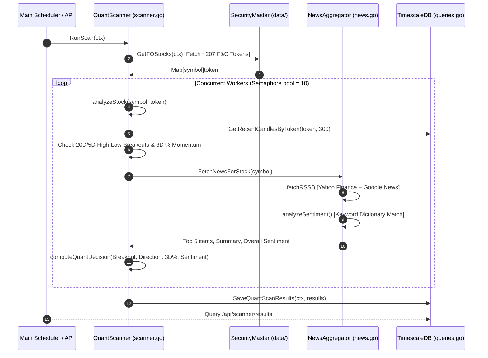

# Zerodha Automated Intraday Trading Bot

Production-grade Go implementation of an algorithmic intraday trading system for Zerodha Kite Connect API.

## Architecture

### Components

- **Data Layer** (`data/`): WebSocket ticker, OHLCV candle aggregation, security master, time-series database
- **Strategy Layer** (`strategy/`): Technical indicators (VWAP, ATR, RSI), signal generation engine
- **Execution Layer** (`execution/`): Order placement, status tracking, resilient API wrapper
- **Risk Management** (`risk/`): Capital preservation, position tracking, circuit breakers
- **Monitoring** (`monitoring/`): Structured logging, Prometheus metrics

### Key Features

✅ **Resilient**: Automatic retry with exponential backoff, circuit breaker for cascading failures  
✅ **Real-time**: WebSocket ticker, 5-minute candle aggregation, sub-second latency  
✅ **Safe**: Dynamic SL with ATR, capital preservation, daily loss limits, margin monitoring  
✅ **Observable**: Prometheus metrics, structured logging (JSON), order tracking  
✅ **Web Dashboard**: Interactive real-time candlestick charts with execution trade markers and dynamic tooltips
✅ **Modular**: Clean separation of concerns, easy to extend strategies  

## Prerequisites

- Go 1.24+
- PostgreSQL 13+ (for TimescaleDB and caching)
- Zerodha Kite Connect API credentials

## Setup

### 1. Environment Configuration

```bash
cp .env.example .env
```

Edit `.env`:

```env
# Zerodha Kite API
KITE_API_KEY=your_api_key
KITE_API_SECRET=your_api_secret
KITE_USER_ID=your_user_id
KITE_ACCESS_TOKEN=your_access_token

# Database
DB_HOST=localhost
DB_PORT=5432
DB_USER=postgres
DB_PASSWORD=your_password
DB_NAME=zerodha_trading
DB_SSL_MODE=disable


# Trading
INITIAL_CAPITAL=500000
MAX_TRADES_PER_DAY=20
MAX_LOSS_STREAKS=3
MAX_HOLDING_TIME_MIN=30
MAX_CAPITAL_PER_TRADE=20000.0
MAX_DAILY_LOSS_AMOUNT=10000.0

# Monitoring
LOG_LEVEL=info
```

### 2. Database Setup

```bash
# Create database and enable TimescaleDB
createdb zerodha_trading
psql zerodha_trading -c "CREATE EXTENSION IF NOT EXISTS timescaledb;"
```

### 3. Dependencies

```bash
go mod download
go mod tidy
```

### 4. Build & Run

```bash
go build -o trading-bot
./trading-bot
```

### 5. Seeding Historical Data

To seed 1 week of historical 1-minute and 5-minute candles for all Nifty 50 instruments into the database, run:

```bash
go run scripts/seed/main.go
```

* **Live Mode**: If a valid `KITE_ACCESS_TOKEN` is configured in `.env`, the script will query Zerodha's `/historical` API to load real historical candles.
* **Mock Mode**: If no access token is set, it automatically falls back to generating a high-fidelity procedural simulation.

## Interactive Web Dashboard

The application features an embedded, high-performance web dashboard to track trades, monitor watchlist tickers, and visualize live intraday charts.

### 🌐 Accessing the Dashboard

Once the application container starts, open your browser and navigate to:
👉 **`http://localhost:8080/zt`**

*(Note: Navigating to the root `http://localhost:8080/` automatically redirects you to `/zt` via a `301 Moved Permanently` header).*

### 📊 Key Dashboard UI Features

1. **Intraday Candlestick & Volume Chart**:
   - Renders 5-minute OHLCV candles using TradingView's high-performance **Lightweight Charts** library.
   - Restricts transaction volume to the bottom 20% overlay pane.
   - Automatically centers and fits visible candles on symbol load via `fitContent()`.

2. **Trade Markers**:
   - Buy entries are marked with a blue **Up Arrow** below the entry candle.
   - Sell entries are marked with a pink **Down Arrow** above the entry candle.
   - Exact entry and exit prices are displayed on the markers.

3. **Dynamic Watchlist Dropdown**:
   - The dropdown list automatically syncs with the trading engine. It displays only active, subscribed watchlist symbols.

4. **Return Metric Hover Tooltips**:
   - Hovering over the percentages in the **Daily Net P&L** card triggers tooltips detailing:
     - **Margin Return**: Return on leveraged capital locked.
       $$\text{Margin Return \%} = \frac{\text{Net P\&L}}{\text{Total Trade Value} / 5} \times 100$$
     - **Account Growth**: Return on entire portfolio size.
       $$\text{Account Growth \%} = \frac{\text{Net P\&L}}{\text{INITIAL\_CAPITAL}} \times 100$$

### ⚙️ Manual Day Overrides & Pre-Market Controls (from 09:00 AM)

The dashboard features a **Daily Watchlist Selections** console tab where users can manage watchlist stocks, assign customized strategies, and control trade eligibility starting from **09:00:00 AM IST**.

1. **Pre-Market 09:00 AM Trading & Strategy Tagging**:
   - Users can input comma-separated stock symbols with optional strategy tags (e.g. `AMBER:NEWS, IDFCFIRSTB:NEWS, SBIN:PDH_PDL`).
   - Manual stocks are immediately registered on startup/input, subscribed for live WebSocket streaming, and preserved across restarts with distinctive amber badges (`FO+SEC+NEWS` / `MA`).
   - Configurable via `STOCK_SELECT_TIME` (default `09:00:00`) and UI Settings toggle **Consider Manual Stocks from 09:00 AM**.

2. **Dynamic Watchlist Recalculation**:
   - The UI includes a **`⚡ Recalculate Watchlist`** button that triggers `POST /api/watchlist/recalculate`.
   - Bypasses cached daily watchlist checks (`force=true`) to dynamically re-screen the entire F&O and Sector momentum universe, merging them seamlessly with active manual stocks.

3. **Active Selected Sectors & Live Timestamps**:
   - The UI sidebar and mobile drawer feature a real-time **Selected Sectors** widget displaying top gaining/declining sectors with exact execution timestamps (`Selected at HH:MM:SS IST`).
   - Automatically cleans previous selections for the day (`ClearSelectedSectors`) so only the top active sectors (default: 2) are displayed.

4. **Stock Trade Eligibility & Actions**:
   - Each stock in the Daily Watchlist Selections tab displays its current eligibility status (**`ELIGIBLE`** or **`EXCLUDED`**).
   - Users can **Delete** (exclude) or **Restore** stocks for trading directly from the table.
   - Clicking any stock row loads its complete candlestick, volume, EMA, and PDH/PDL technical chart data on the canvas.

5. **Toast Notification Engine**:
   - Modern non-blocking overlay toasts auto-dismiss in 2 seconds upon configuration updates or stock additions.

## Modular Strategy Architecture

The bot features a modular multi-strategy execution framework. Multiple strategies can run concurrently on incoming live tick feeds and candle closes, configurable dynamically via environment variables. Executed orders and completed trades are saved in the database with their originating strategy name (e.g. `LOW_VOLUME`, `VANDE_BHARAT`) for tracking and analysis.

### Active Strategies Configuration
Set the enabled strategies in your `.env` file using the `ACTIVE_STRATEGIES` key (comma-separated):
```env
ACTIVE_STRATEGIES=LOW_VOLUME,VANDE_BHARAT
```

---

## Strategy 1: Low-Volume Breakout (`LOW_VOLUME`)
## Strategy 1: Low Volume Breakout (`LOW_VOLUME`)

The **Low Volume Breakout** strategy exploits opening volume exhaustion and VWAP compression by identifying stocks breaking out from the session's absolute lowest volume candle. Supports configurable **5-Minute (Default)** or **1-Minute** timeframe via the UI.

### Step-by-Step Execution Rules
1. **Timeframe Selection**: Operates on **5-Minute (Default)** or **1-Minute** candles selectable directly via the UI Settings modal (`LV_CANDLE_TIMEFRAME`).
2. **1st Candle Qualification (09:15 AM IST)**:
   * **BUY Setup**: The 1st candle of the session MUST close strictly **above PDH** (`1st_Candle.Close > PDH`).
   * **SELL Setup**: The 1st candle of the session MUST close strictly **below PDL** (`1st_Candle.Close < PDL`).
   * **Disqualification Guard**: If the 1st candle closes inside previous day range (`PDL ≤ Close ≤ PDH`), the symbol is permanently disqualified for the day.
3. **Setup Candle Identification (Option A Lowest Volume)**:
   * Scans completed candles since 09:15 AM to find the completed candle with the **absolute lowest volume of the session**.
   * **BUY Setup Candle**: MUST be a **RED** candle (`Close < Open`).
   * **SELL Setup Candle**: MUST be a **GREEN** candle (`Close > Open`).
4. **Single Immediate Next-Candle Window**:
   * A breakout is **strictly valid ONLY during the single candle immediately following the lowest-volume setup candle**.
   * If price does not break out on that immediate next candle, the setup expires.
5. **Live Breakout Trigger**:
   * **BUY Trigger**: Live tick `LTP >= SetupCandle.High`.
   * **SELL Trigger**: Live tick `LTP <= SetupCandle.Low`.
6. **Stop-Loss & Target Sizing**:
   * **BUY SL**: `SetupCandle.Low * (1 - SL_BUFFER_PCT / 100)` (Default 0.1% buffer).
   * **SELL SL**: `SetupCandle.High * (1 + SL_BUFFER_PCT / 100)`.
   * **Target 1**: Set to 1:2 Risk-Reward attached.

### Concrete Walkthrough Example
```
Stock: TCS (Yesterday PDL = ₹2,302.30 | Timeframe: 5m)
• Step 1 (09:15 AM Qualification): 1st candle closes at ₹2,298.40 (< PDL ₹2,302.30) → Symbol qualified for SELL (Short).
• Step 2 (09:25–09:30 AM Setup Candle): 5m candle forms the lowest volume of the morning (54,229 volume) with Low = ₹2,275.40, High = ₹2,281.00 (GREEN candle).
• Step 3 (09:35 AM Immediate Breakout): Live tick drops to ₹2,275.00 on the immediate next candle → Bot executes SELL TCS at ₹2,276.40!
• Step 4 (Risk Placement): SL placed at ₹2,281.00 × 1.001 = ₹2,283.30. Target 1 (1:2 RR) set at ₹2,269.80.
• Step 5 (09:45 AM Target Exit): Price reaches ₹2,269.10 → Target 1 achieved with +₹7.30/share profit!
```

---

## Strategy 2: Refined Vande Bharat Setup (`VANDE_BHARAT`)

The **Refined Vande Bharat** strategy implements a high-performance institutional opening-momentum breakout model checking Previous Day High/Low references, Master candle formation, Candle 2 SL anchoring / Confirmation, and strict immediate 3rd-candle execution windows.

### Step-by-Step Execution Rules (4 Core Rules)
1. **Rule 1 (Candle 2 Breaks Master High/Low — Confirmation Breakout)**:
   * When Master Candle (09:15–09:20 AM) forms:
   * **BUY**: If Candle 2 (09:20–09:25 AM) **breaks Master High** (`Candle2.High > Master.High`):
     - Candle 2 becomes the **Confirmation Candle** (and `Candle2.Low` is locked as the Stop-Loss anchor).
     - The trade is initiated when live price breaks **Confirmation High** (`LTP > Candle2.High`) in the 3rd candle.
   * **SELL**: If Candle 2 **breaks Master Low** (`Candle2.Low < Master.Low`):
     - Candle 2 becomes the **Confirmation Candle** (and `Candle2.High` is locked as the Stop-Loss anchor).
     - The trade is initiated when live price breaks **Confirmation Low** (`LTP < Candle2.Low`) in the 3rd candle.
2. **Rule 2 (Candle 2 Inside Master Range — Master High/Low Breakout Fallback)**:
   * When Master Candle (09:15–09:20 AM) forms:
   * **BUY**: If Candle 2 does **NOT break Master High** (`Candle2.High <= Master.High`):
     - Candle 2 serves as the SL Anchor (`SL = Candle2.Low`).
     - As soon as the next candle breaks **Master High** (`LTP > Master.High`), the trade is **immediately initiated on Master High breakout**!
   * **SELL**: If Candle 2 does **NOT break Master Low** (`Candle2.Low >= Master.Low`):
     - Candle 2 serves as the SL Anchor (`SL = Candle2.High`).
     - As soon as the next candle breaks **Master Low** (`LTP < Master.Low`), the trade is **immediately initiated on Master Low breakdown**!
3. **Rule 3 (Wait for Breakout & Strict Breakout-Candle Execution Guard)**:
   * The engine **waits** while price consolidates inside range for the Master/Confirmation level to break.
   * When the breakout candle breaks the trigger level, the trade MUST be initiated in that breakout candle.
   * If the breakout candle closes without trade execution, the setup is **cancelled and expired immediately** (no late entries on subsequent candles).
4. **Rule 4 (Vice-Versa for SELL / Breakdown)**:
   * Exact mirror symmetry applied to all SELL setups with SL anchored to Candle 2 High and breakdown triggered at Confirmation Low (Rule 1) or Master Low (Rule 2).

### Concrete Walkthrough Example
```
Stock: SBIN (Yesterday Close = ₹800.00, PDH = ₹812.00, PDL = ₹795.00 | Timeframe: 5m)
• Candle 1 (09:15–09:20 AM Master): Opens at ₹817.00, closes GREEN at ₹822.00 (> PDH ₹812.00, High = ₹824.00, Low = ₹815.00).
• Candle 2 (09:20–09:25 AM SL Anchor / Confirmation):
  - Scenario A: High = ₹825.00 (> Master High ₹824.00), Low = ₹819.00 → Candle 2 is Confirmation High (₹825.00), SL = ₹819.00.
  - Scenario B: High = ₹823.50 (≤ Master High ₹824.00), Low = ₹819.00 → Trigger Level is Master High (₹824.00), SL = ₹819.00.
• Candle 3 (09:25–09:30 AM Execution Window):
  - Live tick crosses trigger level during Candle 3 → Bot executes BUY SBIN with SL @ ₹819.00 and 1:2 Target @ ₹835.00!
  - If Candle 3 closes without trigger, setup expires immediately.
```

---

## Strategy 3: Triple SuperTrend Multi-Index Options Selling Strategy (`OPTIONS_SUPERTREND`)

The **Triple SuperTrend Options Selling Strategy** executes autonomous Out-Of-The-Money (OTM) option selling based on 5-minute Triple SuperTrend trend direction across multiple configured indices dynamically via `OPTIONS_ACTIVE_INDICES` (e.g. `NIFTY 50`, `BANKNIFTY`, `SENSEX`, `FINNIFTY`, `MIDCPNIFTY`).

### Step-by-Step Execution Rules
1. **Multi-Index Dynamic Routing**: Operates concurrently on all active indices configured in `.env` (`OPTIONS_ACTIVE_INDICES=NIFTY 50,BANKNIFTY,SENSEX`):
   * **NIFTY 50**: Token `256265`, Spot `NSE`, Opts `NFO`, Base Lot `65`, Strike Step `50`, Expiry: Last Thursday.
   * **BANK NIFTY**: Token `260105`, Spot `NSE`, Opts `NFO`, Base Lot `15`, Strike Step `100`, Expiry: Last Thursday.
   * **BSE SENSEX**: Token `265`, Spot `BSE`, Opts `BFO`, Base Lot `20`, Strike Step `100`, Expiry: Last Friday.
   * **FINNIFTY**: Token `257801`, Spot `NSE`, Opts `NFO`, Base Lot `65`, Strike Step `50`, Expiry: Last Tuesday.
   * **MIDCPNIFTY**: Token `288009`, Spot `NSE`, Opts `NFO`, Base Lot `120`, Strike Step `25`, Expiry: Last Monday.
2. **Indicators & Non-Repainting Forward Evaluation**:
   * Calculates 3 SuperTrend lines on 5-minute index candles: `ST1 (10, 4.0)`, `ST2 (7, 3.0)`, `ST3 (7, 2.0)`.
   * Evaluated **ONLY on fully completed closed 5-minute candles** (`cTime <= nowFloored - 5m`), completely excluding live forming mid-candles.
3. **Directional Decisions**:
   * **`BULLISH`**: Completed Candle Close > All 3 SuperTrends $\rightarrow$ Sell **`PE`** (Put Option) OTM below spot targeting entry premium.
   * **`BEARISH`**: Completed Candle Close < All 3 SuperTrends $\rightarrow$ Sell **`CE`** (Call Option) OTM above spot targeting entry premium.
4. **Strike Selection & Monthly Expiry Rollover**:
   * Scans live option chain to select strike closest to target premium (`argmin |LTP - TargetPremium|`, default ₹100.0 for NIFTY, ₹250.0 for BANKNIFTY/SENSEX).
   * Trades Monthly Expiry (`OPTIONS_EXPIRY_TYPE=MONTHLY`). When $\le 7$ days remain before expiry (`OPTIONS_NEXT_MONTH_DAYS=7`), automatically rolls over to Next Month's contract.
5. **Reversal Multiplier Scaling**:
   * Starts at 1x Lot. On each confirmed trend reversal across all 3 SuperTrends, multiplier increments: `1x → 2x → 3x → 4x` (capped at `OPTIONS_MAX_MULTIPLIER`).
6. **50% Initial SL & 20% Trailing SL Ratchet**:
   * Initial SL Trigger = `Entry Premium * 1.50` (50% max loss).
   * Evaluated on completed 5m candle closes: `Candidate SL = Current Premium * 1.20`.
   * **Monotonic Ratchet**: SL tightens down when premium decays, but remains strictly constant if premium bounces adversely.
7. **Timing Cutoffs**:
   * Last New Trade Time: `14:32:00 IST` (`OPTIONS_LAST_NEW_TRADE_TIME`).
   * Auto Square-Off Time: `15:13:00 IST` (`OPTIONS_AUTO_SQUARE_OFF_TIME`).

### Concrete Walkthrough Example
```
Instrument: NIFTY 50 (Spot: 24,750 | Base Lot: 65 | Target Premium: ₹100.00)
• Step 1 (09:20 AM Candle Close): ST1 (10, 4.0), ST2 (7, 3.0), ST3 (7, 2.0) all turn Green (BULLISH).
• Step 2 (Strike Selected): Scans chain → NIFTY 24600 PE trading at ₹98.50 is selected. Bot sells 65 qty (1x) at ₹98.50.
• Step 3 (Risk Anchors): Initial SL = ₹98.50 × 1.50 = ₹147.75.
• Step 4 (Mid-Day Decay & Trailing SL): Spot rallies; PE premium drops to ₹60.00. Trailed SL auto-adjusts to ₹60.00 × 1.20 = ₹72.00.
• Step 5 (11:15 AM Reversal to BEARISH): All 3 SuperTrends turn Red. Bot squares off PE at ₹45.00 (+₹3,477.50 profit) and sells 130 qty (2x) of 24800 CE at ₹115.00!
```

---

## Strategy 4: Fake Breakout Strategy (`FAKE_BREAKOUT`)

The **Fake Breakout Strategy** exploits opening gap exhaustion (4.0% to 8.0%) where aggressive retail traders get trapped on oversized opening gaps, triggering an immediate fade reversal.

### Step-by-Step Execution Rules
1. **Timeframe Selection**: Operates on **1-Minute (Default)** or **5-Minute** candles selectable directly via the UI (`FB_CANDLE_TIMEFRAME`).
2. **Opening Gap Constraints (09:15 AM IST)**:
   * **SELL Setup**: Opens above Yesterday's Close / PDH with Gap Up between **4.0% and 8.0%** (`4.0% <= GapUp <= 8.0%`, configurable via `FB_GAP_UP_MIN_PCT` and `FB_GAP_UP_MAX_PCT`).
   * **BUY Setup**: Opens below Yesterday's Close / PDL with Gap Down between **4.0% and 8.0%** (`4.0% <= GapDown <= 8.0%`, configurable via `FB_GAP_DOWN_MIN_PCT` and `FB_GAP_DOWN_MAX_PCT`).
3. **Master Candle (1st Candle 09:15 AM IST)**:
   * **SELL Setup**: Must close **RED** (`Close < Open`) with Upper + Lower wicks $\le 40\%$ (`FB_MASTER_MAX_WICK_PCT`).
   * **BUY Setup**: Must close **GREEN** (`Close > Open`) with Upper + Lower wicks $\le 40\%$ (`FB_MASTER_MAX_WICK_PCT`).
4. **Confirmation Candle (2nd Candle 09:16 AM)**:
   * **SELL Setup**: Must close **RED** (`Close < Open`), break Master Low (`Low < Master.Low`), and range $\le 1.0\%$ (`(High - Low) / Close * 100 <= 1.0%`).
   * **BUY Setup**: Must close **GREEN** (`Close > Open`), break Master High (`High > Master.High`), and range $\le 1.0\%$ (`(High - Low) / Close * 100 <= 1.0%`).
5. **Trade Execution (From 3rd Candle Onward)**:
   * Entries permitted strictly starting from the **3rd candle onward** (`candle_count >= 3`) until `FB_TRADE_END_TIME` (default `11:00:00 IST`).
   * **SELL Trigger**: Live tick `LTP <= Confirmation.Low`. Stop-Loss is fixed at **2nd Candle High** (`Confirmation.High * (1 + SLBufferPct)`).
   * **BUY Trigger**: Live tick `LTP >= Confirmation.High`. Stop-Loss is fixed at **2nd Candle Low** (`Confirmation.Low * (1 - SLBufferPct)`).

### Concrete Walkthrough Example
```
Stock: INFY (Yesterday Close = ₹1,500.00 | Timeframe: 1m)
• Step 1 (09:15 AM Master Candle): Opens at ₹1,575.00 (+5.0% Gap Up) and closes RED at ₹1,560.00 (High = ₹1,578.00, Low = ₹1,555.00, Wicks = 28% ≤ 40%).
• Step 2 (09:16 AM Confirmation Candle): Opens at ₹1,560.00, breaks Master Low (₹1,555.00), and closes RED at ₹1,550.00 (High = ₹1,562.00, Low = ₹1,548.00, Range = 0.90% ≤ 1.0%).
• Step 3 (Stop-Loss Locked): SL locked at 2nd Candle High = ₹1,562.00.
• Step 4 (09:17:15 AM 3rd Candle Entry): Live tick drops to ₹1,547.80 (breaks Confirmation Low ₹1,548.00) → Bot enters SELL INFY at ₹1,547.80 with SL at ₹1,562.00!
```

---

### Strategy 5: Vande Bharat Trap Strategy (`VANDE_BHARAT_TRAP`)

The **Vande Bharat Trap Strategy** capitalizes on opening false breakouts where the 1st candle breaks Previous Day High (PDH) or Low (PDL) but closes with an opposite body color (Fake Master), trapping counter-trend retail participants. When price subsequently breaches the Fake Master extreme, a genuine Vande Bharat Master candle is established, triggering high-probability momentum breakouts.

### Step-by-Step Execution Rules (5 Core Rules)
1. **Rule 1 (Fake Master Candle — 09:15 AM IST)**:
   * **BUY Trap**: 1st candle closes **above PDH** (`Close > PDH`), body must be **RED** (`Close < Open`), and range $\le 3.0\%$ (`VBT_FAKE_MASTER_MAX_PCT`).
   * **SELL Trap**: 1st candle closes **below PDL** (`Close < PDL`), body must be **GREEN** (`Close > Open`), and range $\le 3.0\%$ (`VBT_FAKE_MASTER_MAX_PCT`).
2. **Rule 2 (Genuine Master Formation)**:
   * A subsequent candle breaking **Fake Master High** (for BUY) or **Fake Master Low** (for SELL) establishes the **Genuine Vande Bharat Master Candle** (`MasterMaxPct` $\le 1.8\%$, `MasterMaxWickPct` $\le 40\%$).
3. **Rule 3 (2nd Candle SL Anchor & Confirmation / Master Fallback)**:
   * The single candle immediately following Genuine Master must have range between **0.5% and 1.0%** (`VBT_SL_MIN_PCT` to `VBT_SL_MAX_PCT`):
   * **Confirmation Breakout**: If Candle 2 breaks Master High/Low, Candle 2 becomes Confirmation with SL at Candle 2 Low (BUY) or High (SELL). Trigger price is **Confirmation High / Low**.
   * **Master Fallback**: If Candle 2 does NOT break Master High/Low, Candle 2 is only SL Anchor. Trigger price remains **Master High / Low** directly.
4. **Rule 4 (Wait for Breakout & Strict Breakout-Candle Execution Guard)**:
   * The engine **waits** while price consolidates inside range.
   * When a breakout candle breaks the trigger level, the trade MUST be initiated in that breakout candle.
   * If the breakout candle closes without trade execution, the setup is **cancelled and expired immediately at candle close** (no late entries on subsequent candles).
5. **Rule 5 (Mirror Symmetry for SELL)**:
   * Exact mirror symmetry applied to breakdown SELL setups with SL anchored at Candle 2 High and breakdown triggered at Confirmation Low or Master Low.

### Concrete Walkthrough Example
```
Stock: TCS (Yesterday Close = ₹3,450.00, PDH = ₹3,500.00, PDL = ₹3,400.00 | Timeframe: 5m)
• Step 1 (09:15 AM Fake Master): Opens at ₹3,520.00, High = ₹3,525.00, Low = ₹3,505.00, and closes RED at ₹3,508.00 (> PDH ₹3,500.00, Range = 0.57% ≤ 3.0%) → Fake Master BUY Setup Established!
• Step 2 (09:20 AM): Candle stays inside [₹3,505.00, ₹3,525.00].
• Step 3 (09:25 AM Genuine Master): Candle breaks Fake Master High (₹3,525.00) and closes at ₹3,532.00 (High = ₹3,535.00) → Genuine Master Candle Formed!
• Step 4 (09:30 AM 2nd Candle): High = ₹3,540.00 (> Master High ₹3,535.00), Low = ₹3,515.00 (Range = 0.70% in [0.5%, 1.0%]) → Candle 2 is Confirmation High (₹3,540.00), SL anchored at Low = ₹3,515.00!
• Step 5 (Breakout Execution): Live tick breaks ₹3,540.00 → Bot executes BUY TCS with SL anchored at ₹3,515.00! If breakout candle closes without trade, setup expires immediately.
```

---

## Strategy 6: EMA S5 Breakout Strategy (`EMAS5_BREAKOUT`)

The **EMA S5 Breakout Strategy** combines dynamic Exponential Moving Averages (**EMA 10** and **EMA 20**), sequential **'U'-Shape (BUY)** / **Inverted 'U'-Shape (SELL)** oval consolidation curves, configurable EMA Touch Buffer (0.1%), inside consolidation guards, and live breakout execution.

### Step-by-Step Execution Rules (9 Sequential Geometric & Mechanical Anchors)
1. **Timeframe Selection**: Operates on **1-Minute (Default)** or **5-Minute** candles selectable directly via the UI (`ES5_CANDLE_TIMEFRAME`).
2. **Anchor 1 — Starting Extreme (Left Rim Peak/Trough)**:
   * **BUY Setup ('U'-Shape)**: Identifies the Day Highest Peak formed before the pullback (e.g. 09:15 AM High).
   * **SELL Setup (Inverted 'U'-Shape)**: Identifies the Day Lowest Trough formed before the rally.
3. **Anchor 2 — Trough Low / Peak High (Bottom / Top of Oval Curve)**:
   * **BUY**: Identifies the lowest swing bottom formed *after* the Starting Peak.
   * **SELL**: Identifies the highest swing top formed *after* the Starting Trough.
4. **Anchor 3 — Distance Guard (≥ 5 Candles)**:
   * Distance between the swing extreme and candidate Master candle MUST be $\ge 5$ completed candles (`ES5_RALLY_CANDLES`).
5. **Anchor 4 — Rebound / Drop Move (≥ 0.40%)**:
   * **BUY Rebound**: `(Candle.Close - TroughLow) / TroughLow * 100 >= 0.40%` (`ES5_MIN_REBOUND_PCT`).
   * **SELL Drop**: `(PeakHigh - Candle.Close) / PeakHigh * 100 >= 0.40%`.
6. **Anchor 5 — Master Dynamic EMA Touch, Range & Max Wick (%)**:
   * **BUY Master**: GREEN candle (`Close > Open`) whose Low comes within the configured **EMA Touch Buffer** (Default 0.1%, `ES5_EMA_TOUCH_BUFFER_PCT`) of EMA 10 or EMA 20, closes strictly **above EMA 10, EMA 20, and PDH** with Range $\le 2.0\%$ (`ES5_MASTER_MAX_PCT`), and total upper + lower wicks $\le 40.0\%$ (`ES5_MASTER_MAX_WICK_PCT`).
   * **SELL Master**: RED candle (`Close < Open`) whose High comes within EMA Touch Buffer of EMA 10 or EMA 20, closes strictly **below EMA 10, EMA 20, and PDL** with Range $\le 2.0\%$, and total wicks $\le 40.0\%$.
7. **Anchor 6 — Master Extreme Invalidation Guard**:
   * Breaching Master Low (for BUY) or Master High (for SELL) immediately cancels the setup.
8. **Anchor 7 — Inside Consolidation Guard**:
   * Evaluated strictly between Master and Confirmation candles. Allows maximum 1 inside candle (`ES5_MAX_INSIDE_CANDLES`). More than 1 inside candle immediately invalidates the setup.
9. **Anchor 8 — Strict Confirmation Candle Close & Color Guard**:
   * **BUY Confirmation**: Must break Master High AND MUST close strictly **ABOVE Master High** (`Close > Master.High`) with a **GREEN** body (`Close > Open`). If it merely wicks above Master High but closes below Master High or closes RED/DOJI, it is rejected as a bull-trap and **invalidates the setup immediately**. Range $\le 1.0\%$ (`ES5_CONFIRM_MAX_PCT`).
   * **SELL Confirmation**: Must break Master Low AND MUST close strictly **BELOW Master Low** (`Close < Master.Low`) with a **RED** body (`Close < Open`). If it merely wicks below Master Low but closes above Master Low or closes GREEN/DOJI, it is rejected as a bear-trap and **invalidates the setup immediately**. Range $\le 1.0\%$.
10. **Anchor 9 — Active Breakout Waiting Window & Post-Confirmation Invalidation**:
    * **Live Breakout Trigger**: Evaluates sub-second real-time WebSocket ticks. Enters BUY at `LTP >= Confirmation.High` (SL at `Confirmation.Low * 0.999`, Target 1 at 1:2 RR) or SELL at `LTP <= Confirmation.Low` (SL at `Confirmation.High * 1.001`, Target 1 at 1:2 RR).
    * **Opposite Level Breach Invalidation**: If price drops below `Confirmation.Low` or `Master.Low` (for BUY) or rises above `Confirmation.High` or `Master.High` (for SELL) before triggering, the setup is **immediately cancelled**.
    * **Timing Cutoff Invalidation**: All pending breakout setups automatically expire when clock reaches `11:00:00 IST` (`ES5_TRADE_END_TIME`).
    * **Daily Trade Limit**: Enforces maximum **2 trades per stock per day** (`ES5_MAX_TRADES_PER_STOCK`).

### Concrete Walkthrough Examples

#### Example 1: 5-Minute Timeframe (`5m`) — APLAPOLLO on 28-Aug-2026
```
Stock: APLAPOLLO (28-Aug-2026 | Timeframe: 5m | EMA Touch Buffer: 0.1%)
• Step 1 (Starting Peak): 09:15 AM High = ₹2207.20.
• Step 2 (Trough Low): 09:15 AM Low = ₹2182.50 (Bottom of 'U'-Shape).
• Step 3 (Trade #1 Master Candle): 10:00 AM Master forms with Open: ₹2193.90, High: ₹2201.00, Low: ₹2193.40 (touches EMA 10 ₹2194.91 & EMA 20 ₹2194.69), Close: ₹2200.40 (+0.82% rebound from ₹2182.50 > 0.40% min).
• Step 4 (Confirmation): 10:05 AM Confirmation breaks Master High to ₹2205.00 and closes GREEN at ₹2204.60.
• Step 5 (Trade #1 Breakout Trigger): 10:10 AM live tick breaks Confirmation High at ₹2205.00! Initial SL: ₹2195.20, Target 1: ₹2224.59.
• Step 6 (Trade #2 Master Candle): 10:45 AM Master forms with Low: ₹2212.80 (within 0.1% buffer of EMA 10 ₹2210.70 limit ₹2212.91), Close: ₹2215.50 GREEN.
• Step 7 (Confirmation): 10:50 AM Confirmation closes GREEN at ₹2217.80 (High: ₹2219.00).
• Step 8 (Trade #2 Breakout Trigger): 11:00 AM live tick breaks Confirmation High at ₹2219.00!
```

#### Example 2: 1-Minute Timeframe (`1m`) — APLAPOLLO on 28-Aug-2026
```
Stock: APLAPOLLO (28-Aug-2026 | Timeframe: 1m | EMA Touch Buffer: 0.1%)
• Trade #1 (10:04 AM Trigger): Master at 10:02 AM (Close ₹2194.40 GREEN, touched EMA 10/20) → Confirmation at 10:03 AM (High ₹2199.00 GREEN) → Triggered at 10:04 AM at ₹2199.00!
• Trade #2 (10:16 AM Trigger): Master at 10:11 AM (Low ₹2202.00 was within 0.1% buffer of EMA 10 ₹2201.82, Close ₹2204.80 GREEN) → Confirmation at 10:12 AM (High ₹2208.30 GREEN) → Triggered at 10:16 AM at ₹2208.30! Surged to ₹2218.10!
```

---

## Stop-Loss & Target Management (All Strategies)
* **Risk Per Trade Position Sizing Formula**:
  The bot calculates the exact trade quantity dynamically according to user-configured **Risk Per Trade** (e.g. ₹500.0) and Stop-Loss distance ($R_{\text{distance}} = |P_{\text{entry}} - P_{\text{SL}}|$):
  $$\text{Quantity} = \min\left( \left\lfloor \frac{\text{Risk Per Trade}}{R_{\text{distance}}} \right\rfloor, \left\lfloor \frac{\text{Capital Pool}}{\text{Margin Per Share}} \right\rfloor \right)$$
  Where:
  * $\text{Margin Per Share} = P_{\text{entry}} / 5$ (for 5x intraday MIS leverage).
  * $\text{Max Loss if SL Hit} = \text{Quantity} \times R_{\text{distance}} \le \textbf{Risk Per Trade}$.
* **Risk Buffer**: The initial trade risk is buffered to prevent stops from triggering on market noise:
  * **Low Volume Breakout**: Uses a 0.1% buffer (configurable via UI `sl_buffer_pct`).
  * **Vande Bharat Breakout**: Uses a 0.1% buffer (configurable via UI `sl_buffer_pct`).
  * **Fake Breakout Trap**: Uses a 0.1% buffer (configurable via UI `sl_buffer_pct`).
  * **Vande Bharat Trap**: Uses a 0.1% buffer (configurable via UI `sl_buffer_pct`).
* **Stop-Loss (SL)**: Set at $\text{Entry} - \text{Buffered Risk}$ (for Long) or $\text{Entry} + \text{Buffered Risk}$ (for Short).
* **Target 1 (1:2 R:R)**: Set at $\text{Entry} + (\text{Buffered Risk} \times \text{RISK\_REWARD\_RATIO})$ (for Long) or $\text{Entry} - (\text{Buffered Risk} \times \text{RISK\_REWARD\_RATIO})$ (for Short).
* **Exit Scaling**:
  1. Once **Target 1** is hit, **50% of the position** is closed immediately at market price.
  2. The Stop-Loss for the remaining 50% of the position is moved to the **Entry Price** (breakeven cost-to-cost).
  3. If the remaining position is not stopped out, it is held until the market-close hard square-off override (configured by `AUTO_SQUARE_OFF_TIME`, default **03:20 PM IST**).
* **Partial Entry Fills**:
  If an entry order is cancelled (either due to candle window timeout or manually) and has a partial fill (`FilledQuantity > 0`):
  1. The bot does **not** close the trade; instead, it accepts the filled amount as the active position size.
  2. The position quantity in the Risk Manager is updated to the actual filled quantity.
  3. A broker-side Stop-Loss order is placed (or tracked internally) for the **updated quantity** at the precalculated SL price.
  4. The trade continues to execute normally.

---

## Analytical Suite: Intraday Expected Move & Option Delta Engine (`EXPECTED_MOVE`)

The application includes a real-time mathematical expected move and option sensitivity calculator available under the **`🎯 Expected Move`** dashboard tab and accessible via HTTP GET `/api/options/expected-move`.

### 1. Key Mathematical Models
* **India VIX Daily Volatility Range**:
  $$\text{Daily \% Move} = \frac{\text{India VIX}}{\sqrt{365}}$$
  $$\text{Daily Points} = \text{Spot Price} \times \text{Daily \% Move}$$
  $$\text{Remaining Intraday Move} = \text{Daily Points} \times \sqrt{\frac{H_{\text{remaining}}}{6.25}}$$
* **ATM Straddle Market Maker Bounds**:
  $$\text{ATM Strike} = \text{Round}\left(\frac{\text{Spot}}{50}\right) \times 50$$
  $$\text{Market Maker Expected Move} = 0.85 \times \text{ATM Straddle Price (CE + PE)}$$
* **Option Sensitivity (Black-Scholes Delta & Theta)**:
  * **Delta ($\Delta$)**: Evaluated dynamically based on strike moneyness ($0.50$ ATM, $0.12$ to $0.88$ for OTM/ITM).
  * **Theta ($\Theta$)**: Time-decay loss per hour $\frac{-(\text{LTP} \times 0.04)}{H_{\text{remaining}}}$.
  * **Premium Shift Table**: Instant projected contract prices for $+50$, $+100$, $-50$, and $-100$ point index shifts.

### 2. Strict Live Data Mandate
* All market inputs (NIFTY 50 Spot, India VIX Index, ATM Straddle Quotes, Option Contract LTP) are fetched **strictly from live Zerodha REST/WebSocket APIs** (`tb.kiteClient.GetQuote`), or if unquoted, queried directly from PostgreSQL database table `candles_5m`. Zero static price fallbacks or assumptions are permitted.

---

## Risk Framework

| Parameter | Default Value | Description |
| :--- | :--- | :--- |
| `ACTIVE_STRATEGIES` | `LOW_VOLUME,VANDE_BHARAT,OPTIONS_SUPERTREND` | Comma-separated list of active strategies to execute |
| `LV_CANDLE_TIMEFRAME` | `5m` | Configurable candle timeframe for Low Volume Breakout (`1m` / `5m`) |
| `VB_CANDLE_TIMEFRAME` | `1m` | Configurable candle timeframe for Vande Bharat Momentum (`1m` / `5m`) |
| `FB_CANDLE_TIMEFRAME` | `1m` | Configurable candle timeframe for Fake Breakout (`1m` / `5m`) |
| `VBT_CANDLE_TIMEFRAME` | `1m` | Configurable candle timeframe for Vande Bharat Trap (`1m` / `5m`) |
| `ES5_CANDLE_TIMEFRAME` | `1m` | Configurable candle timeframe for EMA S5 Breakout (`1m` / `5m`) |
| `LV_TRADE_END_TIME` | `10:45:00` | Trade entry cutoff time (IST) for Low Volume Breakout |
| `VB_TRADE_END_TIME` | `11:00:00` | Trade entry cutoff time (IST) for Vande Bharat Momentum |
| `FB_TRADE_END_TIME` | `11:00:00` | Trade entry cutoff time (IST) for Fake Breakout Trap |
| `VBT_TRADE_END_TIME` | `11:00:00` | Trade entry cutoff time (IST) for Vande Bharat Trap |
| `ES5_TRADE_END_TIME` | `11:00:00` | Trade entry cutoff time (IST) for EMA S5 Breakout |
| `VBT_FAKE_MASTER_MAX_PCT` | `3.0%` | Max range % for 1st Fake Master candle (09:15 AM) |
| `VBT_MASTER_MAX_PCT` | `1.8%` | Max range % for Master candle and price move from PDH/PDL |
| `VBT_SL_MIN_PCT` | `0.5%` | Min range % for 2nd candle (SL Anchor) |
| `VBT_SL_MAX_PCT` | `1.0%` | Max range % for 2nd candle (SL Anchor) |
| `VBT_MASTER_MAX_WICK_PCT` | `40.0%` | Max upper + lower wick % for Master candle |
| `RISK_PER_TRADE` | `₹500.0` | Maximum currency loss allocated per single trade (`Quantity = floor(Risk / SL_Distance)`) |
| `INITIAL_CAPITAL` | `₹1,00,000` | Base portfolio size |
| `MAX_OPEN_POSITIONS` | `3` | Maximum concurrent open positions active simultaneously in Equity |
| `MAX_TRADES_PER_DAY` | `20` | Maximum Equity executions allowed per session (Options excluded) |
| `OPTIONS_MAX_TRADES_PER_DAY`| `10` | Independent maximum daily Options trades allowed per index |
| `OPTIONS_ACTIVE_INDICES` | `NIFTY 50,BANKNIFTY,SENSEX,FINNIFTY,MIDCPNIFTY` | Comma-separated active indices to trade concurrently |
| `OPTIONS_LIVE_INDICES` | `(empty)` | Comma-separated indices for LIVE broker trading (unlisted run in PAPER mode, 'ALL' for all) |
| `BOT_RESTART_ALLOWED_BEFORE` | `09:15` | Pre-market cutoff time (IST) for UI bot restarts |
| `BOT_RESTART_ALLOWED_AFTER` | `15:45` | Post-market cutoff time (IST) for UI bot restarts (locked during market hours) |
| `SUPERTREND_ST1_FACTOR` | `4.0` | Multiplier for SuperTrend 1 (ST1: 10, 4.0) |
| `SUPERTREND_ST2_FACTOR` | `3.0` | Multiplier for SuperTrend 2 (ST2: 7, 3.0) |
| `SUPERTREND_ST3_FACTOR` | `2.0` | Multiplier for SuperTrend 3 (ST3: 7, 2.0) |
| `OPTIONS_BASE_LOT_SIZE` | `65` | Default base option lot size in quantity (1x Lot = 65 Qty) |
| `OPTIONS_MAX_QUANTITY_MULTIPLIER` | `4` | Maximum lot size multiplier cap for options trading |
| `OPTIONS_LAST_NEW_TRADE_TIME` | `14:30:00` | Cutoff time (IST) after which no new option trades are taken |
| `OPTIONS_AUTO_SQUARE_OFF_TIME` | `15:15:00` | EOD auto square-off cutoff time (IST) for options |
| `OPTIONS_SL_PCT` | `50.0` | Option stop-loss percentage (50% premium increase) |
| `OPTIONS_LIVE_TRADING` | `false` | Enable live option execution on Zerodha exchange |
| `AUTO_SQUARE_OFF_TIME` | `15:15:00` | Dynamic market-close hard square-off time (IST) for equity |
| `MAX_CAPITAL_PER_TRADE` | `₹20,000` | Max cash allocation per trade setup |
| `MAX_DAILY_LOSS_AMOUNT` | `₹10,000` | Max portfolio loss limit (Circuit breaker) |
| `MAX_LOSS_STREAKS` | `3` | Stop trading after N consecutive losses |
| `MAX_HOLDING_TIME_MIN` | `30` | Max holding time minutes for MIS positions |
| `MANUAL_TRADE_SYNC_ENABLED` | `true` | Enable periodic background sync of manual trades from Zerodha |
| `MANUAL_TRADE_POLL_MINUTES` | `5` | Polling schedule interval (minutes) for manual trades sync |
| `MANUAL_TRADE_ATTACHED_RR_STRATEGY` | `PARTIAL_BOOK_COST_SL` | Attached risk-reward strategy for manual trades (`PARTIAL_BOOK_COST_SL` or `DYNAMIC_TRAILING_SL`) |
| `MANUAL_TRADE_RR_RATIO` | `2.0` | Target 1 Risk:Reward multiplier (1:X) for partial book |
| `MANUAL_TRADE_PARTIAL_EXIT_PCT` | `50.0` | Quantity percentage to book at Target 1 |
| `MANUAL_TRADE_DEFAULT_SL_PCT` | `1.5` | Fallback SL percentage if no active broker SL order exists |
| `MANUAL_TRADE_MOVE_SL_TO_COST` | `true` | Move SL to Cost (+ buffer) upon reaching Target 1 |
| `MANUAL_TRADE_COST_BUFFER_PCT` | `0.05` | Buffer percentage added to Entry Price when moving SL to cost |
| `MANUAL_TRADE_USE_BROKER_SL` | `true` | Place/update live broker Stop-Loss orders on Zerodha for manual trades |
| `STRATEGY_WATCHLIST_SIZE` | `10` | Target watchlist portfolio size per strategy |
| `WATCHLIST_MAX_PCT_CHANGE` | `100.0%` | Max percentage change to allow watchlist inclusion |

## API Endpoints

### Monitoring

---

## 🎯 Quant Stock & News Scanner (`QUANT_SCANNER`)

The application includes a production-grade **Quant Stock & News Scanner** located in [`scanner/`](file:///C:/Users/Dell/OneDrive/Desktop/cz/zt/scanner) that scans all ~207 F&O constituent stocks concurrently to generate intraday/swing trading signals powered by technical breakouts and real-time news sentiment.

---

### 1. News RSS Aggregation & Recency Window

The news engine ([`scanner/news.go`](file:///C:/Users/Dell/OneDrive/Desktop/cz/zt/scanner/news.go)) collects financial news headlines dynamically without requiring paid third-party APIs:

* **Sources**:
  1. **Yahoo Finance RSS**: `https://finance.yahoo.com/rss/headline?s=<SYMBOL>.NS`
  2. **Google News RSS (Fallback/Augment)**: `https://news.google.com/rss/search?q=<SYMBOL>+stock+India&hl=en-IN&gl=IN&ceid=IN:en`
* **Item Cap & Recency**:
  - RSS feeds return items sorted by publication date (`pubDate`).
  - The engine limits context to the **top 5 most recent live headlines** per stock.
  - Depending on company news frequency, these 5 headlines represent news published over the **last 1 to 3 days (24 to 72 hours)**.

---

### 2. Headline Sentiment Analysis Engine

In [`scanner/news.go`](file:///C:/Users/Dell/OneDrive/Desktop/cz/zt/scanner/news.go#L129), `analyzeSentiment(text string)` classifies every headline by evaluating financial domain keywords:

* **Bullish Keywords (+1 point each)**:
  `profit`, `surge`, `gain`, `upgrade`, `order`, `rally`, `growth`, `record`, `expansion`, `bullish`, `jump`, `high`, `buy`, `outperform`, `revenue`, `dividend`, `acquisition`, `win`, `approval`
* **Bearish Keywords (-1 point each)**:
  `loss`, `fall`, `drop`, `downgrade`, `penalty`, `slump`, `decline`, `bearish`, `plunge`, `low`, `sell`, `underperform`, `investigation`, `strike`, `fraud`, `warning`, `cut`, `default`
* **Aggregate Classification**:
  - If $\text{Positive Headlines} > \text{Negative Headlines} \rightarrow$ Overall Sentiment = **`POSITIVE`**
  - If $\text{Negative Headlines} > \text{Positive Headlines} \rightarrow$ Overall Sentiment = **`NEGATIVE`**
  - Otherwise $\rightarrow$ Overall Sentiment = **`NEUTRAL`**

---

### 3. Quantitative Decision Engine & Scoring Model

In [`scanner/scanner.go`](file:///C:/Users/Dell/OneDrive/Desktop/cz/zt/scanner/scanner.go#L277), `computeQuantDecision()` calculates a **Quant Confidence Score (0.0 to 100.0)** starting from a base score of **50.0**:

$$\text{Confidence Score} = 50.0 + \text{Breakout Weight} + (\text{3-Day \% Change} \times 3.5) + \text{News Sentiment Weight} + \text{Volume Surge Bonus}$$

#### Mathematical Weighting Breakdown:

| Factor | Condition | Score Adjustment | Weight Contribution |
| :--- | :--- | :--- | :--- |
| **Technical Breakout** | `MONTHLY_HIGH_BREAK` ($\ge$ 20-Day High) | $+25.0$ pts | **40%** |
| | `WEEKLY_HIGH_BREAK` ($\ge$ 5-Day High) | $+15.0$ pts | |
| | `MONTHLY_LOW_BREAK` ($\le$ 20-Day Low) | $-25.0$ pts | |
| | `WEEKLY_LOW_BREAK` ($\le$ 5-Day Low) | $-15.0$ pts | |
| **Multi-Day Momentum** | 3-Day % Price Change (`pct3D`) | $\text{pct3D} \times 3.5$ pts | **30%** |
| **News Sentiment** | News Sentiment == `POSITIVE` | $+10.0$ pts | **20%** |
| | News Sentiment == `NEGATIVE` | $-10.0$ pts | |
| **Volume Surge Multiplier** | $\text{Volume 1D} / \text{20-Day ADV} \ge 1.5x$ | $+5.0$ pts (Bull) / $-5.0$ pts (Bear) | **10%** |

#### Macro Benchmarks & Commodities (Option / Futures Signals):

* **📌 NIFTY 50 Index**:
  - Score $\ge 60.0 \rightarrow$ **`SELL PE 300-OTM (BULLISH)`**
  - Score $\le 40.0 \rightarrow$ **`SELL CE 300-OTM (BEARISH)`**
  - Score $40.1 - 59.9 \rightarrow$ **`NO OPTION SELL (NEUTRAL)`**
* **🥇 GOLD Commodity (MCX)**:
  - Score $\ge 60.0 \rightarrow$ **`BUY GOLD FUT / PE SELL`**
  - Score $\le 40.0 \rightarrow$ **`SELL GOLD FUT / CE SELL`**
  - Score $40.1 - 59.9 \rightarrow$ **`NO GOLD TRADE`**
* **🛢️ CRUDE OIL Commodity (MCX)**:
  - Score $\ge 60.0 \rightarrow$ **`BUY CRUDE FUT / PE SELL`**
  - Score $\le 40.0 \rightarrow$ **`SELL CRUDE FUT / CE SELL`**
  - Score $40.1 - 59.9 \rightarrow$ **`NO CRUDE TRADE`**

#### Action Threshold Matrix:

| Confidence Score | Quant Direction | Recommended Action | Strategy Execution |
| :--- | :--- | :--- | :--- |
| **$\ge 75.0$** | **`STRONG_BULLISH`** | `BUY_ON_DIP` | High-priority Long entry |
| **$60.0 - 74.9$** | **`BULLISH`** | `ACCUMULATE` | Standard Long entry |
| **$40.1 - 59.9$** | **`NEUTRAL`** | `WATCHLIST_ONLY` | Hold on watchlist |
| **$25.1 - 40.0$** | **`BEARISH`** | `REDUCE_LONG` | Trim existing Long positions |
| **$\le 25.0$** | **`STRONG_BEARISH`** | `SHORT_ON_RALLY` | High-priority Short entry |

---

### 4. Code-Level Execution Flow (Step-by-Step)



1. **Initialization ([`main.go`](file:///C:/Users/Dell/OneDrive/Desktop/cz/zt/main.go))**: `QuantScanner` is instantiated with `NewsAggregator`, `Database`, and `SecurityMaster`.
2. **Universe Fetching ([`scanner/scanner.go: RunScan`](file:///C:/Users/Dell/OneDrive/Desktop/cz/zt/scanner/scanner.go#L48))**: Retrieves all active F&O constituent tokens from `SecurityMaster.GetFOStocks()`.
3. **Parallel Stock Analysis ([`scanner/scanner.go: analyzeStock`](file:///C:/Users/Dell/OneDrive/Desktop/cz/zt/scanner/scanner.go#L89))**: Uses a worker pool of 10 concurrent goroutines to analyze daily candle history (60 days) and compute 20-day high/low breakouts, 3-day momentum, and range expansion.
4. **News Scraping & Parsing ([`scanner/news.go: fetchRSS`](file:///C:/Users/Dell/OneDrive/Desktop/cz/zt/scanner/news.go#L84))**: Performs HTTP GET requests to Yahoo/Google News RSS feeds, unmarshals XML into `RSSItem` structs, and extracts publication timestamps.
5. **Sentiment Scoring ([`scanner/news.go: analyzeSentiment`](file:///C:/Users/Dell/OneDrive/Desktop/cz/zt/scanner/news.go#L129))**: Evaluates each headline against positive/negative financial keyword lists and determines overall stock news sentiment.
6. **Quant Decision Synthesis ([`scanner/scanner.go: computeQuantDecision`](file:///C:/Users/Dell/OneDrive/Desktop/cz/zt/scanner/scanner.go#L244))**: Merges breakout type, price momentum %, and news sentiment into a final Quant Confidence Score and recommended action.
7. **Database Storage ([`data/queries.go: SaveQuantScanResults`](file:///C:/Users/Dell/OneDrive/Desktop/cz/zt/data/queries.go#L105))**: Upserts all scan results into the `quant_scan_results` table in TimescaleDB for persistent retrieval.
8. **REST & Web Dashboard Rendering ([`handlers.go`](file:///C:/Users/Dell/OneDrive/Desktop/cz/zt/handlers.go#L425), [`index.html`](file:///C:/Users/Dell/OneDrive/Desktop/cz/zt/index.html))**: Endpoints `/api/scanner/results` and `/api/scanner/run` expose results directly to the web UI dashboard scanner tab.

### API Endpoints

```http
GET  /api/scanner/results - Get latest F&O breakout & momentum scan results
POST /api/scanner/run     - Trigger an immediate manual scan run across all 207 F&O stocks
```

## Error Handling

| Error | Handling |
|-------|----------|
| HTTP 429 (Rate limit) | Exponential backoff |
| HTTP 401 (Auth failed) | Token refresh + retry |
| HTTP 5xx (Server error) | Retry with backoff |
| WebSocket disconnect | Auto-reconnect + fallback to polling |
| Margin call | Reduce position sizes |
| Circuit breaker | Stop trading immediately |

## Monitoring & Debugging

### Checking Logs

The application outputs structured JSON logs. You can view them using Docker:

* **Go App Logs**:
  ```bash
  docker-compose logs -f app
  ```
  *(Or stream and format them using `jq`: `docker-compose logs -f app | jq .`)*
* **All Services Logs (App + DB)**:
  ```bash
  docker-compose logs -f
  ```


### Database Queries

You can connect to the database via command line directly inside the running container:

```bash
docker exec -it zt-postgres-1 psql -U postgres -d zerodha_trading
```

To connect using external GUI clients (pgAdmin, DBeaver, TablePlus, etc.):
* **Host**: `localhost`
* **Port**: `5432`
* **Database Name**: `zerodha_trading`
* **Username**: `postgres`
* **Password**: `trading_password`

Useful SQL queries inside `psql`:

```sql
-- View instrument metadata cache (which replaced Redis)
SELECT key, updated_at, LEFT(value, 100) AS preview FROM metadata_cache;

-- Recent trades and P&L
SELECT * FROM trades ORDER BY created_at DESC LIMIT 10;

-- Candles for analysis
SELECT * FROM candles_5m WHERE token = 100000 ORDER BY time DESC LIMIT 50;

-- Open positions
SELECT * FROM positions WHERE closed_at IS NULL;
```

## Performance Tuning

### Latency Optimization

- Use PostgreSQL metadata table for instrument master caching
- Connection pooling (25 max conns)
- Async order processing

### Throughput

- 1000+ ticks/second processing
- Sub-100ms candle completion
- Parallel order status polling

## Compliance & Risk

⚠️ **IMPORTANT**: This is a high-frequency trading system. Ensure:

1. You have proper regulatory approval
2. Capital is from dedicated trading account
3. All trades are tracked for tax/audit
4. Broker margin requirements are met
5. Stop-losses are always in place

## Testing

```bash
go test ./...
```

Mock ticker runs on startup for testing without live data.

## Architecture Diagram

```
┌─────────────────────────────────────────┐
│         Zerodha Kite API                 │
│    (WebSocket + REST)                    │
└────────────┬────────────────────────────┘
             │
      ┌──────┴──────┐
      ▼             ▼
┌──────────┐  ┌──────────────┐
│  Ticker  │  │ REST Orders  │
└────┬─────┘  └──────┬───────┘
     │               │
     └───────┬───────┘
             ▼
     ┌───────────────┐
     │ Candle Agg    │ → PostgreSQL (TimescaleDB)
     │ (5-min OHLCV) │
     └───────┬───────┘
             │
             ▼
     ┌───────────────┐
     │ Strategy Eng  │
     │ (Indicators)  │
     └───────┬───────┘
             │ Signal
             ▼
     ┌────────────────┐
     │ Risk Manager   │
     │ Capital Protect│
     └───────┬────────┘
             │
             ▼
     ┌────────────────┐
     │ Execution Mgr  │
     │ Order Mgmt     │
     └─────┬──────────┘
           │
           └──→ PostgreSQL (orders, trades, cache)
```

## License

Proprietary. Use only with explicit permission.

## Support

For issues or questions, contact the development team.
